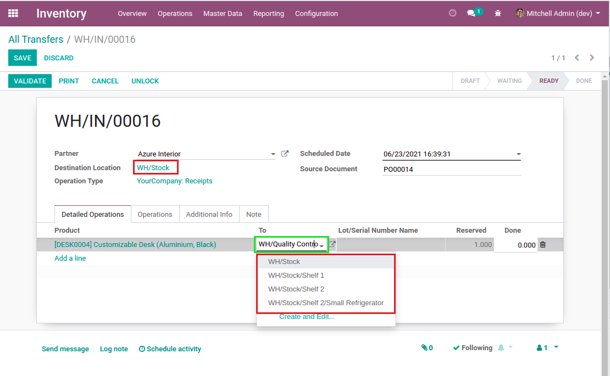
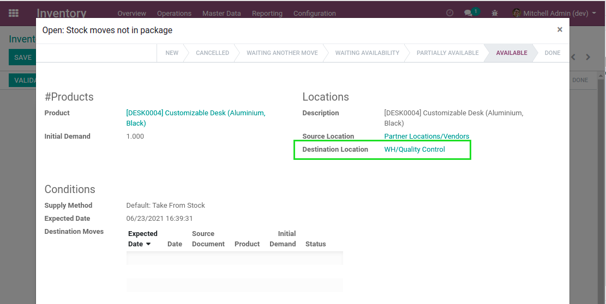

Stock Move Location Domain Improved
===================================
This module improves the domain filter of the destination location on stock move lines.

.. contents:: Table of Contents

Context
-------
In vanilla Odoo, when selecting the destination on detailed operations (stock move lines),
only child locations of the destination location defined on the picking are selectable.

When a automatic push rule is applied to the operation (stock move), its destination location
can be different from the picking.

In such case, the selectable locations on the detailed operations is inconsistent with the
location defined on the operation.

Usage
-----
After installing this module, the selectable locations on detailed operations match the location
defined on the operation.

.. image:: static/description/stock_move_line_destination_fixed.png

Contributors
------------
* Numigi (tm) and all its contributors (https://bit.ly/numigiens)
