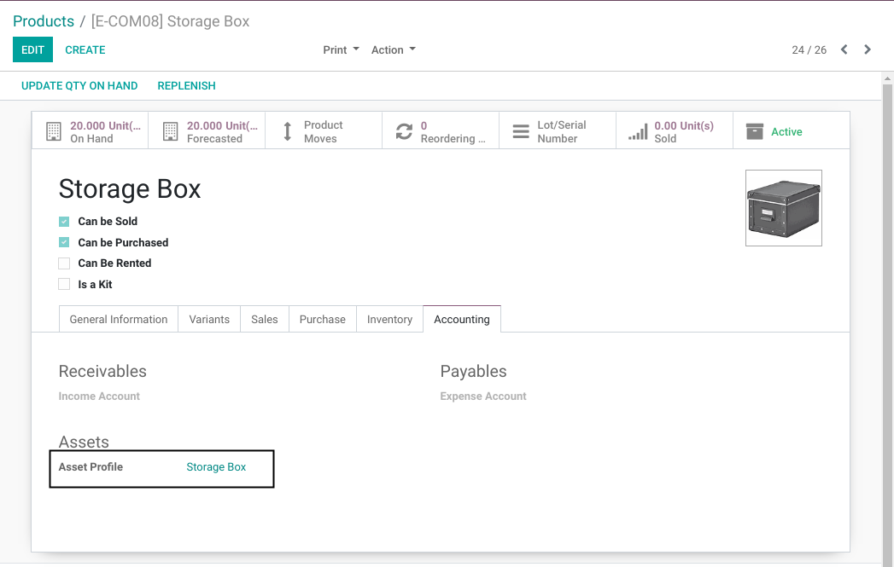
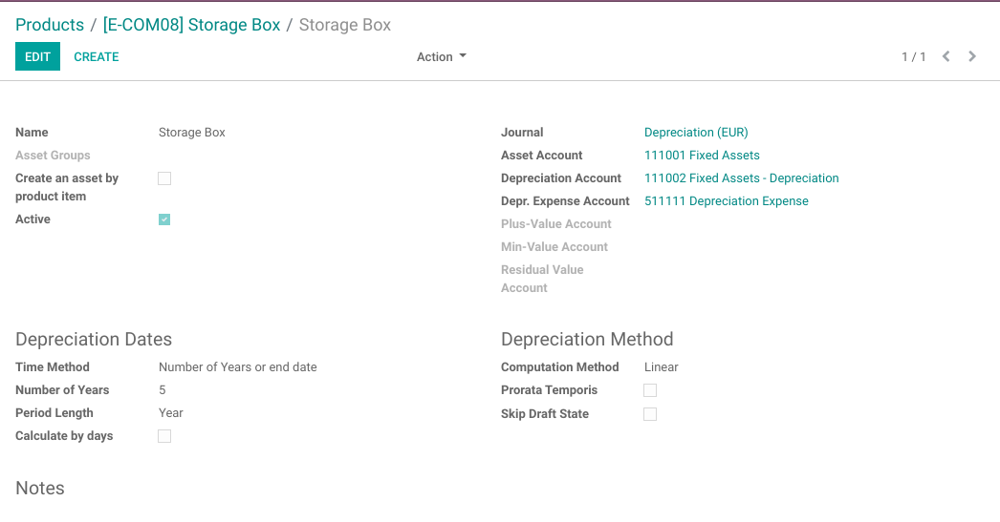
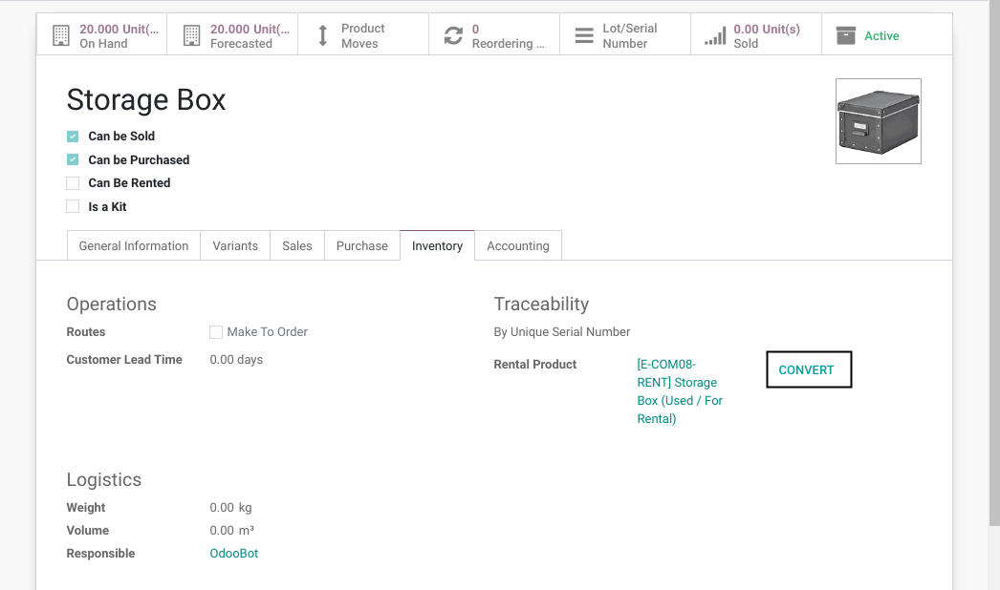
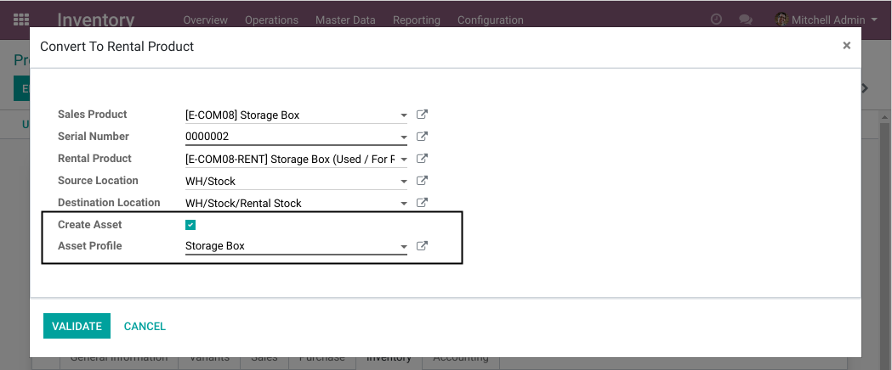
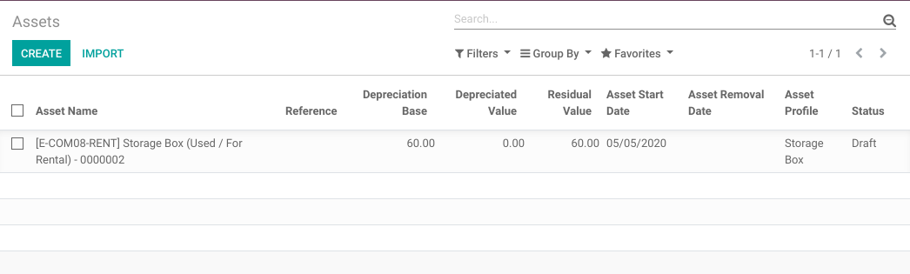
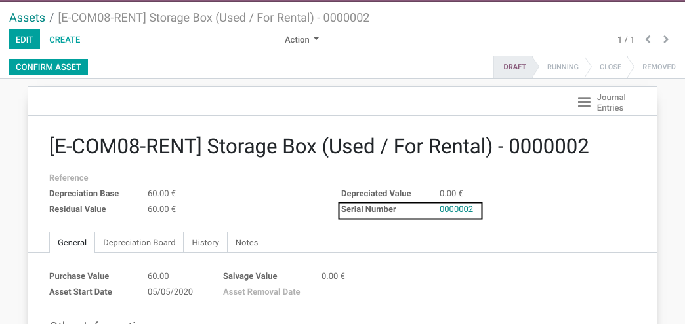

Stock Rental Conversion Asset
=============================
This module allows to generate an asset when convert a salable product into a rental product.

.. contents:: Table of Contents

Context
-------
The module stock_rental_conversion allows to convert a salable product into a rental product.

The module `account_asset_management <https://github.com/OCA/account-financial-tools/tree/12.0/account_asset_management>`_
adds management of assets.

The module `stock_serial_asset <https://github.com/numigi/odoo-stock-addons/tree/12.0/stock_serial_asset>`_ adds a relation
between an asset and a serial number.

Configuration
-------------
I go to the form view of my salable product.

In the ``Inventory Tab``, I find a new field ``Asset Profile``.

This field allows to select a default asset profile to use when converting this salable product
to a rentalable product.

Here is the form view of the selected asset profile.

Usage
-----
I click on the button to open the conversion wizard.

In the form view of the wizard, I notice two new fields:

* ``Create an Asset``
* ``Asset Profile``

By default, the asset profile is filled with the profile selected on the salable product.

..

	If I unchecked the box ``Create an Asset``, an asset would not be created.

I click on ``Validate`` then, I go to the accounting application.

I notice that an asset was created.

In the form view of the asset, I notice that the new asset is linked to my serial number.

Contributors
------------
* Numigi (tm) and all its contributors (https://bit.ly/numigiens)

More information
----------------
* Meet us at https://bit.ly/numigi-com
