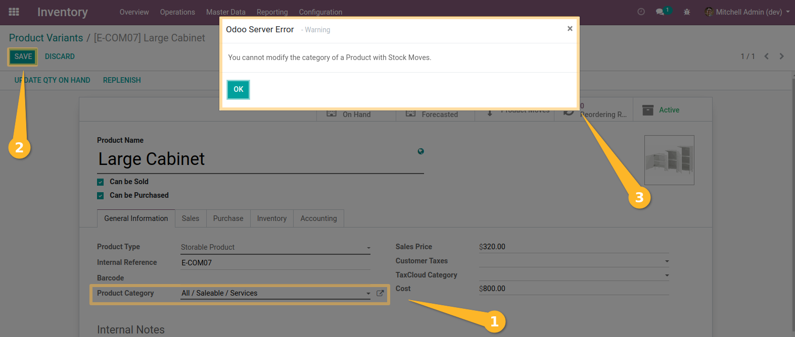
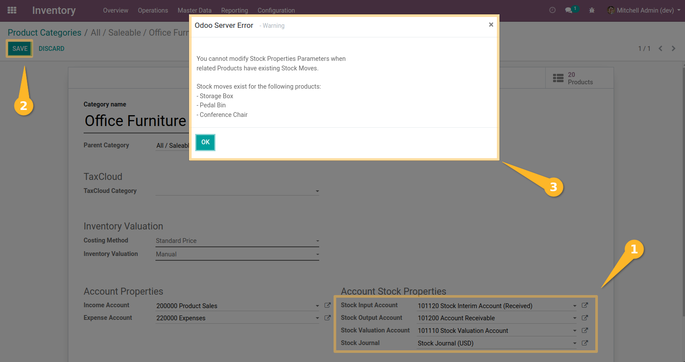

Product Category Safe Change
============================
This module allows to restrict the modification of a product category if the product linked to it has already some stock move
associated to it.

Usage
-----
* Restricting the modification of a category on product

As a user who can edit a product, I go to a product which had already some stock move.
I edit the product and change the category of the product.
I click on the `Save` button.
I get the following blocking error message:

* Restricting Inventory Properties Setup Changes

As a user in the `Inventory/Manager` group, I go to an product category (on `Inventory>Configuration`).
I have access to modify a category.
I try to modify one of the following fields :
-Stock Input Account
-Stock Output Account
-Stock Valuation Account
-Stock Journal
And then click on the `Save` button.

If I have products with this category that have stock move, I get the following blocking error message:

Multi company contrainsts
-------------------------
Examples : in the context of a multi-company database, with shared articles:

The data is as follows:
Companies: Company A, Company B
Category: Category 1
Product: Product 1 (case where I only have this product in the database)

On the database, I have the following stock moves:

* Case 1:
+-----------------+--------------------+-----------+-----------------------+
| Stock move name | Stock move Company | Product   | Constraint applied to |
+=================+====================+===========+=======================+
| BL001           | Company A          | Product 1 | Company A only        |
+-----------------+--------------------+-----------+-----------------------+
Expected result: I can modify the category settings under Company B. I cannot modify the product category since it is common to all companies.

* Case 2:
+-----------------+--------------------+-----------+-------------------------+
| Stock move name | Stock move Company | Product   | Constraint applied to   |
+=================+====================+===========+=========================+
| BL001           | Company A          | Product 1 | Company A and company B |
| BL002           | Company B          | Product 1 | Company A and company B |
+-----------------+--------------------+-----------+-------------------------+
Expected result: I cannot change the category settings under any of the companies (A and B). I cannot modify the category of the product since it is common to all companies.

* Case 3:
+-----------------+--------------------+-----------+-----------------------+
| Stock move name | Stock move Company | Product   | Constraint applied to |
+=================+====================+===========+=======================+
| BL001           | Company B          | Product 1 | Company B only        |
+-----------------+--------------------+-----------+-----------------------+
Expected result: I can modify the category settings under Company A. I cannot modify the item category since it is common to all companies.

NOTICE : 
This behavior is applied in the same way when I have several articles in the database:

1. If the user tries to modify the parameters of a category under a company for which there is no stock.move associated via the products, the constraint is not applied.
2. If the user tries to modify the category of an article, while there is a stock movement associated with the article in the database (all companies combined), then the constraint applies.

Contributors
------------
* Numigi (tm) and all its contributors (https://bit.ly/numigiens)
