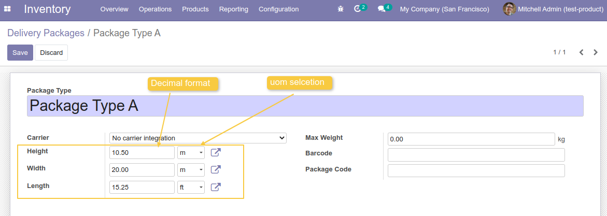
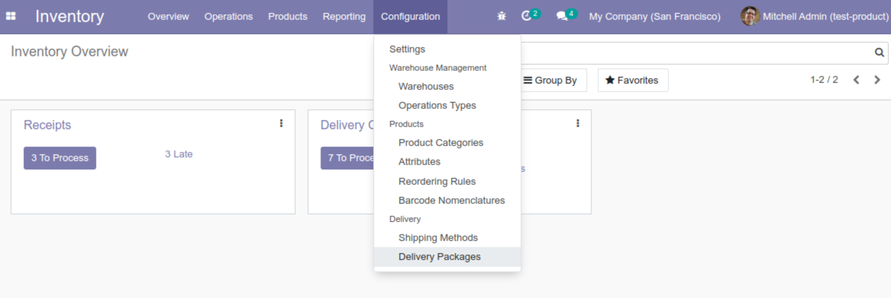

Product Packaging Dimension Decimal and Changeable UOM
======================================================
Add changeable UOM and allow decimal on product packaging.

Usage
-----
As an Administrator of Inventory and having the access right for ``Manage Packages``, 
I go to ``Inventory > Configuration > Delivery Packages``.

In the form view, I can see that ``Height``, ``Width`` and ``Length`` can be in decimal value.
I also can change the unit of measure of each property to ``m`` or ``ft``.

Warning
-------
This module convert the type of ``Height``, ``Width`` and ``Length`` fields from integer to float.
Initially, the value of these fields are integer, by the native module `delivery`.

*If this module is installed, all values from these fields will be reset to 0.0.
So make sure to make a backup of your data before installing this module.*

*If this module is uninstalled, all values from these fields will lose their decimal part. 
Integer fields type will be reused.*

Contributors
------------
* Numigi (tm) and all its contributors (https://bit.ly/numigiens)

More information
----------------
* Meet us at https://bit.ly/numigi-com
