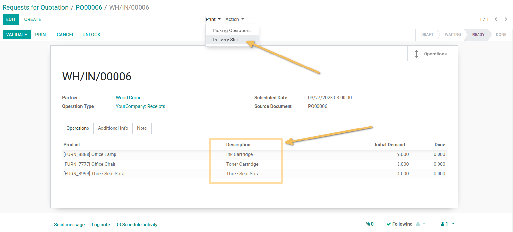
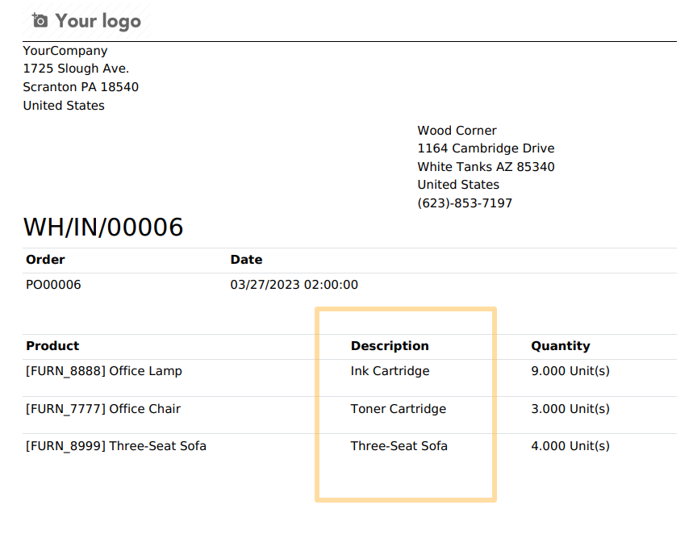

Purchase Stock Move Description
===============================

.. contents:: Table of Contents

Summary
-------

This module customizes columns on operation tree list view on stock picking.

Task Spent Hours
----------------

The module shows the ``Description`` column to the tree list of operations, on the stock picking linked to purchase order.
It will show the column after the product column.

It also add the description column in the report when printing it.

If we create a delivery picking from a purchase order, each order line description will be reported to each operation line description.

The new column added on delivery pdf report.

Contributors
------------

* Numigi (tm) and all its contributors (https://bit.ly/numigiens)
