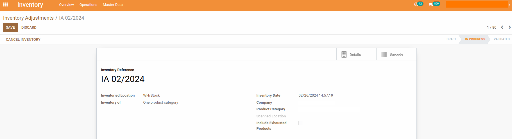

Stock Adjustment Lines Display
==============================
This module gives the stock user access to the detail button for a stock adjustment.

.. contents:: Table of Contents

Summary
-------
The detail button in the stock adjustment view in odoo is only accessible in developer mode

This module prevents access to this button in developer mode and gives this access right to stock users

Usage
-----
As member of the group ``Inventory / User``, I go to the ``Inventory`` app.

I notice that I can click on Details at the inventory adjustment form view

Contributors
------------
* Numigi (tm) and all its contributors (https://bit.ly/numigiens)
