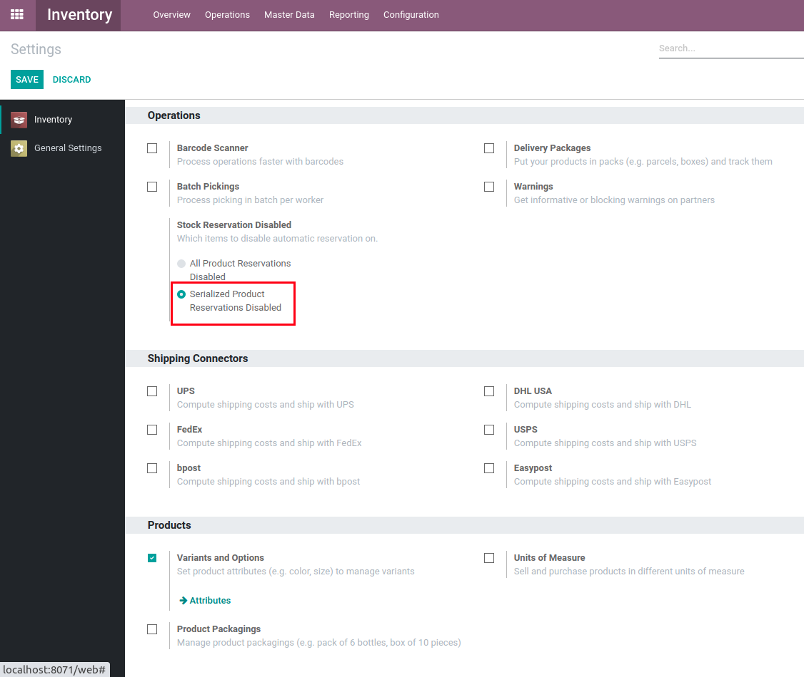

Stock Auto Assign Disabled
==========================
This module disables the automatic stock reservation by the scheduler.

.. contents:: Table of Contents

Configuration
-------------
To select which articles to exclude from automatic reservation, simply head to the inventory section of the settings menu.

You can then select between the 3 desired behaviors.

The default behavior will be that the automatic reservations are enabled (as if the module wasn't installed).

If the **procurement_jit** module is installed, the `Stock Auto Assign Disabled Jit <../stock_auto_assign_disabled_jit/README.rst>`_ module will automatically be installed to also disable its automatic reservations.

Summary
-------
This stock movement has not yet had any quantity of items reserved.

.. image:: static/description/initial.png

We run the scheduler (either manually or automatically after some time).

.. image:: static/description/scheduler.png

Using the **All Product Reservations Disabled** option, there are still no reservations.

.. image:: static/description/no_reservation.png

In the settings menu, you also have the option to disable the automatic stock reservation by the scheduler on serialized articles only, or alternatively turn off all of this module's functionalities.

Contributors
------------
* Numigi (tm) and all its contributors (https://bit.ly/numigiens)
