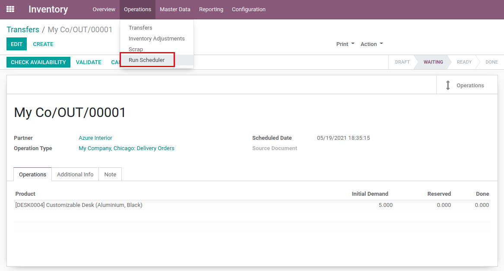
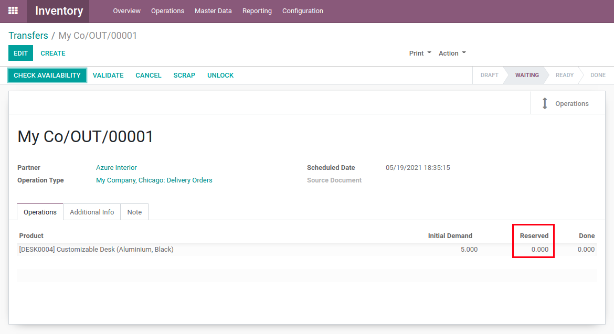
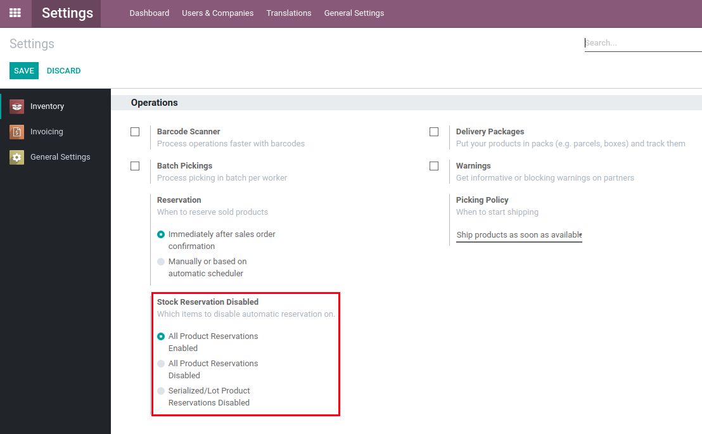

Stock Auto Assign Disabled
==========================
This module disables the automatic stock reservation by the scheduler.

.. contents:: Table of Contents

Summary
-------
This stock movement has not yet had any quantity of items reserved.

.. image:: static/description/initial.png

We run the scheduler (either manually or automatically after some time).

There are still no reservations.

In the settings menu, you also have the option to disable the automatic stock reservation by the scheduler on serialized articles only.

Configuration
-------------
To select which articles to exclude from automatic reservation, simply head to the inventory section of the settings menu.

.. image:: static/description/settings_full.png

You can then select between the 2 desired behaviors.

If the **procurement_jit** module is installed, the `Stock Auto Assign Disabled Jit <../stock_auto_assign_disabled_jit/README.rst>`_ module will automatically be installed to also disable its automatic reservations.

Contributors
------------
* Numigi (tm) and all its contributors (https://bit.ly/numigiens)
