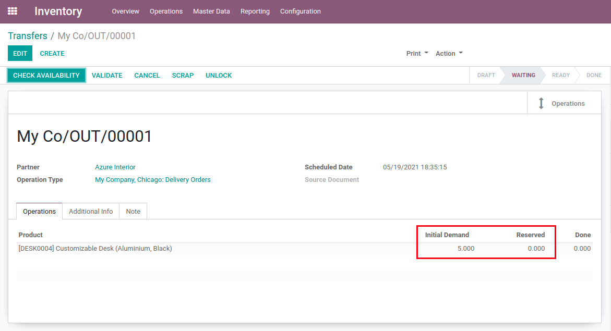

Stock Auto Assign Disabled Jit
==============================
This module extends the `Stock Auto Assign Disabled <../stock_auto_assign_disabled/README.rst>`_ module by also disabling the **procurement_jit** automatic reservation.

.. contents:: Table of Contents

Summary
-------
Upon stock movement creation, no quantities of items will be reserved (since that **procurement_jit** functionality is now disabled).

Configuration
-------------
This module is automatically installed in case the `Stock Auto Assign Disabled <../stock_auto_assign_disabled/README.rst>`_ and **procurement_jit** modules are installed.

No additional configuration is required beyond installation.

Contributors
------------
* Numigi (tm) and all its contributors (https://bit.ly/numigiens)
