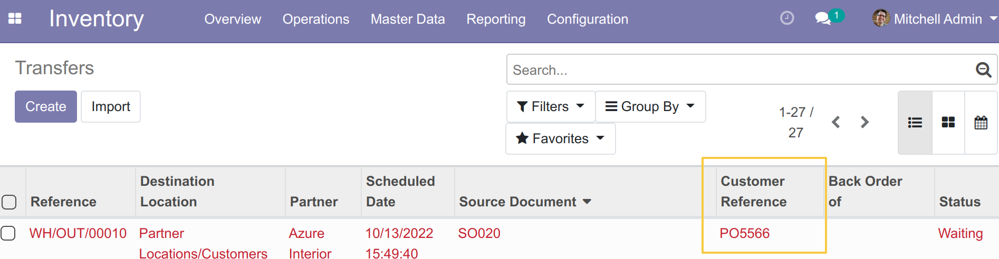
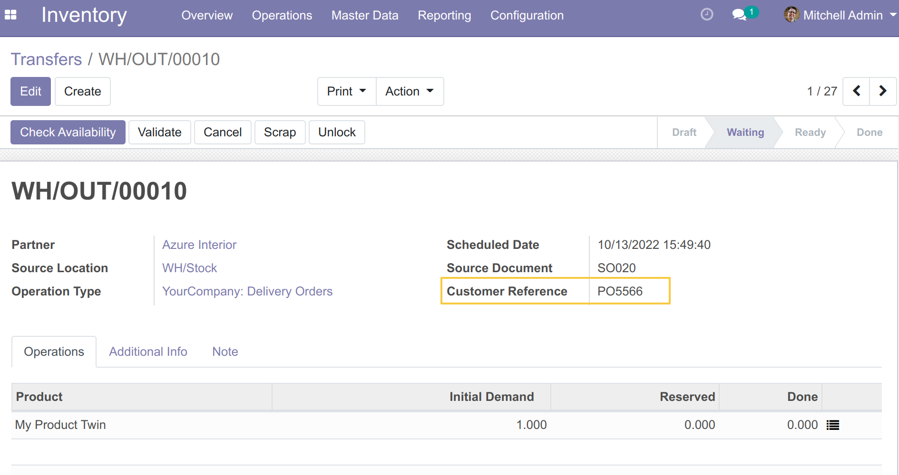
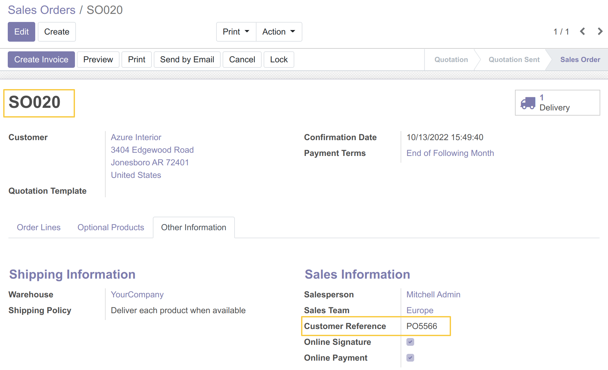
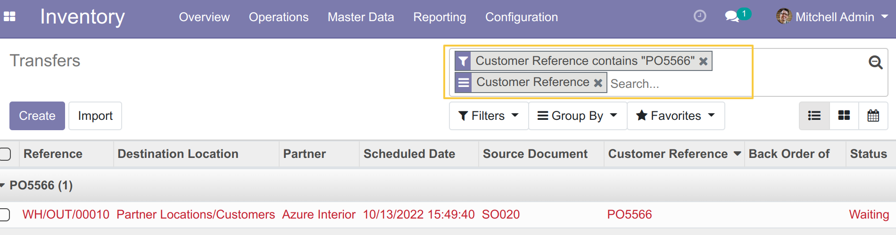

Stock Client Order Reference
============================

Overview
-------

This module add a new field `Customer Reference` to `Inventory / Transfers.

Usage
-----

As a user in the `Inventory / User` group, I go to `Inventory / Transfers.
I can see a new field `Customer Reference` added to the List and Form views.

List View:
~~~~~~~~~~

Form View:
~~~~~~~~~~

The field retrieves the value of the field `Customer Reference` of the sale order mentioned on the `Origin` field.

We can filter and group by the field `Customer Reference` in the `Transfers`.

Contributors
------------
* Numigi (tm) and all its contributors (https://bit.ly/numigiens)

More information
----------------
* Meet us at https://bit.ly/numigi-com
