Stock Component
===============

.. contents:: Table of Contents

Summary
-------
This module adds parentality between serial numbers.

The parent serial number is an equipment.
The children are components, which also can have child components.

When a serial number is moved, all children components are moved with the parent in a transparent way.

Configuration
-------------
In the form view of a serial number, I notice a table ``Components``.

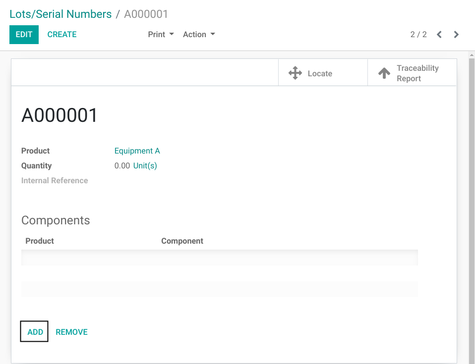

I click on ``Add``.

A wizard is opened.

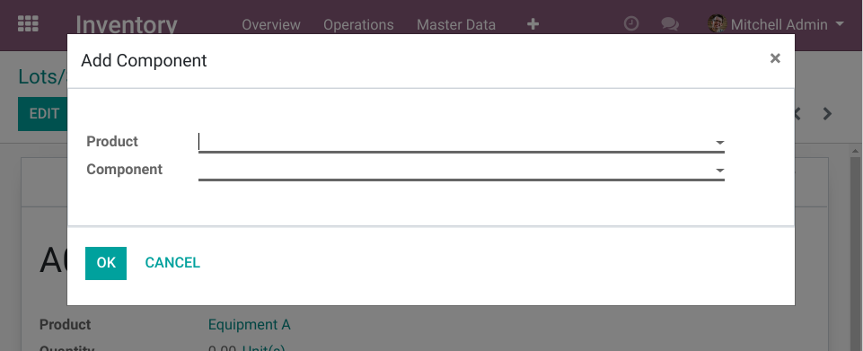

I select a product, then I select the serial number of the component to add.

Then I click on ``OK``.

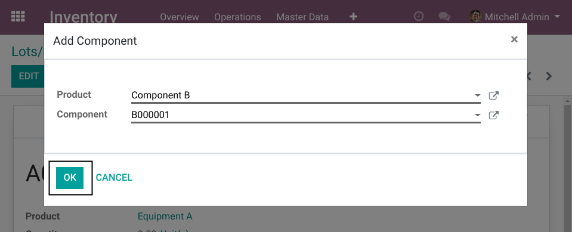

The selected number is now a component of the equipment.

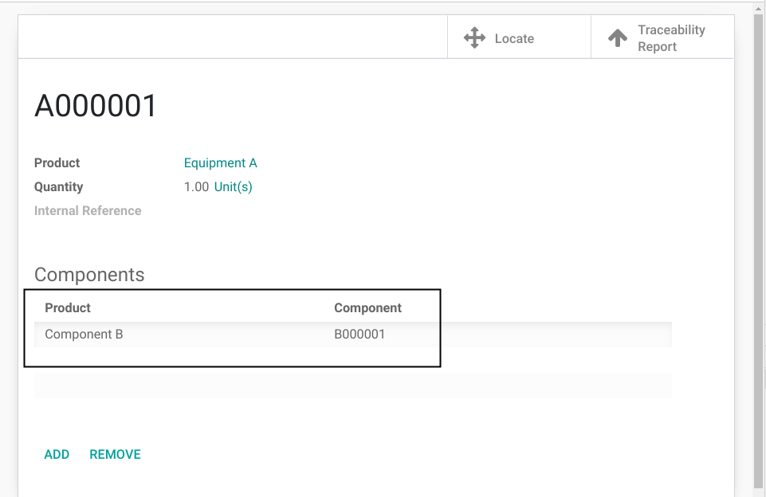

Constraints
~~~~~~~~~~~
When adding a component to a serial number, the child serial number must be located in the same location as the parent.
The component can also be located in a child location under the parent's location.

If the component is in a package, then the parent serial number must be in the same package and vice versa.

If the component has an owner, then the parent serial number must have the same owner and vice versa.

Also, a serial number can not be added as component under multiple parents.

Usage
-----
I create a delivery order and select the equipment.

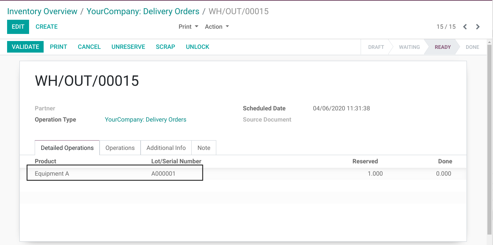

I validate the delivery order.

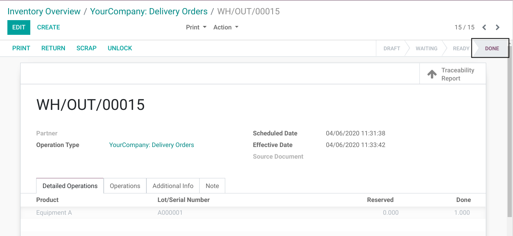

In the global list of stock moves, I notice that the component was moved with the equipment.

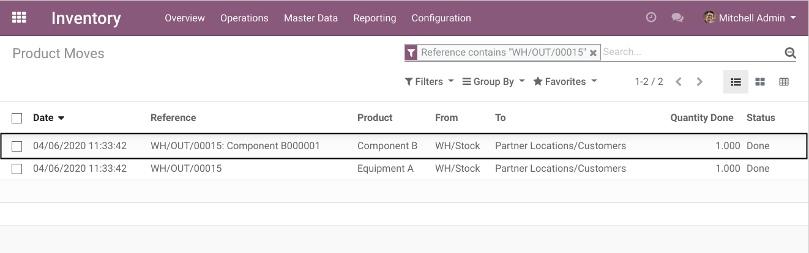

This move generated for the component is what we call a ``Shadow Move``.
It is automatically created when the equipment is moved.

If you attempt to move a child component directly (in a picking or an inventory adjustment),
a blocking message will appear.

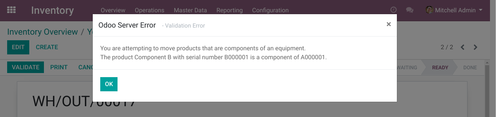

Removing a Component
--------------------
To remove a component from its parent, you must go to the form view of the equipment and click on ``Remove``.

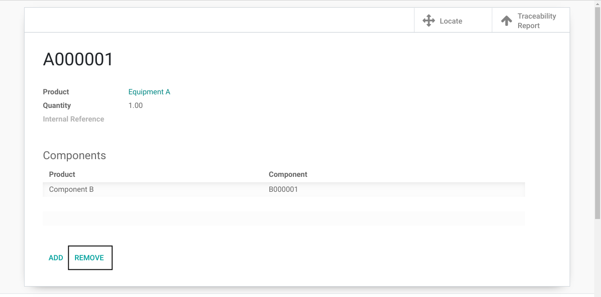

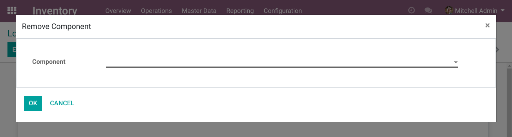

Then select the number to remove and click on ``OK``.

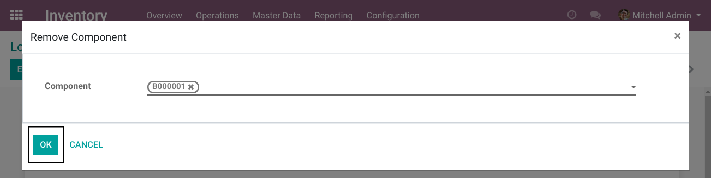

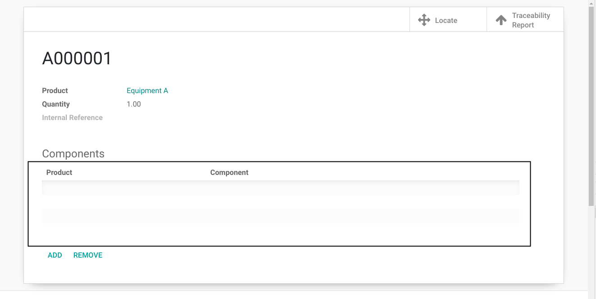

Contributors
------------
* Numigi (tm) and all its contributors (https://bit.ly/numigiens)
