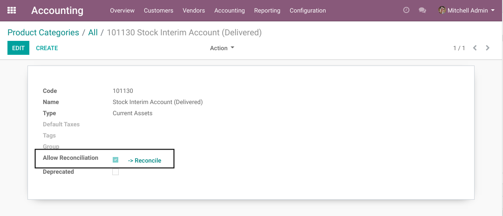
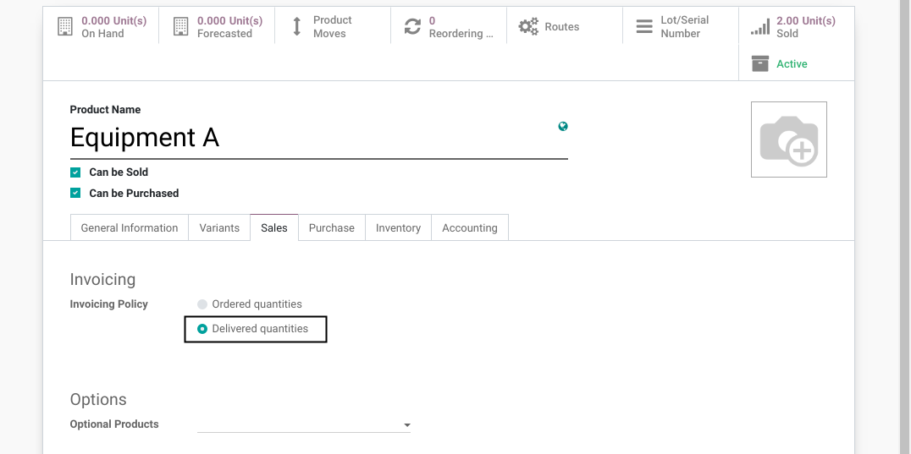

Stock Component Account
=======================

.. contents:: Table of Contents

Context
-------
The module ``stock_component`` generates ``shadow moves`` in order to move
an equipment (a parent serial number) with all its components (child serial numbers)
in a transparent way.

If an equipment is delivered to a customer, the cost recorded for this equipment
should include the cost of its components (recursively).

The complete cost of the equipment must be matched with the related revenue (the customer invoice).

Summary
-------
The module does two things:

* It adjusts the cost of equipments recorded on `Journal Entries of Customer Invoices`_.
* It generates `Extra Journal Entries`_ for delivered equipments.

Journal Entries of Customer Invoices
------------------------------------
When a customer invoice is validated, a journal entry is generated.

The journal entry may look like this:

+---------------------------------------------+---------------+-------+--------+
| Account                                     | Product       | Debit | Credit |
+=============================================+===============+=======+========+
| 1xxxxx - Receivable                         |               |  2300 |      0 |
+---------------------------------------------+---------------+-------+--------+
| 4xxxxx - Sales                              | Equipment A   |     0 |   2000 |
+---------------------------------------------+---------------+-------+--------+
| 2xxxxx - Taxes Payable                      |               |     0 |    300 |
+---------------------------------------------+---------------+-------+--------+
| 5xxxxx - Cost of Goods Sold                 | Equipment A   |  1000 |        |
+---------------------------------------------+---------------+-------+--------+
| 1xxxxx - Stock Interim Account (Delivered)  | Equipment A   |     0 |   1000 |
+---------------------------------------------+---------------+-------+--------+

The amount used for the cost (1000) is based on the value of the stock moves related to the sale order.

The module redefines how this cost is computed for serialized products.
It computes the cost based on value of the stock move associated with the product
plus the cost of its shadow moves (the component moves).

Extra Journal Entries
---------------------
Suppose you deliver an equipment A with a component B.

You have 2 journal entries:

+---------------------------------------------+---------------+-------+--------+
| Account                                     | Product       | Debit | Credit |
+=============================================+===============+=======+========+
| 101130 - Stock Interim Account (Delivered)  | Equipment A   |  1000 |      0 |
+---------------------------------------------+---------------+-------+--------+
| 101110 - Stock Valuation Account            | Equipment A   |     0 |   1000 |
+---------------------------------------------+---------------+-------+--------+

+---------------------------------------------+---------------+-------+--------+
| Account                                     | Product       | Debit | Credit |
+=============================================+===============+=======+========+
| 101130 - Stock Interim Account (Delivered)  | Component B   |   200 |      0 |
+---------------------------------------------+---------------+-------+--------+
| 101110 - Stock Valuation Account            | Component B   |     0 |    200 |
+---------------------------------------------+---------------+-------+--------+

The first entry is linked to the stock move of the equipment.
The second entry is linked to the stock move of the component.

When the customer invoice is validated, the following journal items are created
to record the cost of the equipment.

+---------------------------------------------+---------------+-------+--------+
| Account                                     | Product       | Debit | Credit |
+=============================================+===============+=======+========+
| 5xxxxx - Cost of Goods Sold                 | Equipment A   |  1200 |        |
+---------------------------------------------+---------------+-------+--------+
| 101130 - Stock Interim Account (Delivered)  | Equipment A   |     0 |   1200 |
+---------------------------------------------+---------------+-------+--------+

The invoice will attempt to match this cost with the journal entries linked
to the stock move of the equipment. It will only find the first entry.

Behind the scene, the module adds another journal entry:

+---------------------------------------------+---------------+-------+--------+
| Account                                     | Product       | Debit | Credit |
+=============================================+===============+=======+========+
| 101130 - Stock Interim Account (Delivered)  | Equipment A   |   200 |      0 |
+---------------------------------------------+---------------+-------+--------+
| 101130 - Stock Interim Account (Delivered)  | Component B   |     0 |    200 |
+---------------------------------------------+---------------+-------+--------+

This entry is linked to the stock move of the equipment.

Therfore, when the invoice attempts to reconcile its cost with the equipment delivery,
it finds 2 journal entries with a accurate total of 1200.

Nested Components
-----------------
The module supports nested components.

The cost recorded on the invoice will include the cost of all sub components recursively.

Configuration
-------------

Stock Output Account
~~~~~~~~~~~~~~~~~~~~
In order for the module to work properly, you must allow reconciliation on the
stock output account of your products.

If the account does not allow reconciliation, adjustment journal entries for the cost of delivered goods
waiting to be invoiced will not be generated.

Therefore, the cost of an equipment delivered and waiting to be reconciled with a customer invoice
will exclude the cost of its components.

Invoicing Policy
----------------
Also, make sure that the ``Invoicing Policy`` of the product is set to ``Delivered Quantities``.

This requirement is not due to a limitation in the module. It is due to the standard behavior of Odoo.

With the option ``Invoicing Policy: Ordered Quantities``, the cost of the goods sold on the invoice
is not based on the cost of the delivered products.

Contributors
------------
* Numigi (tm) and all its contributors (https://bit.ly/numigiens)
