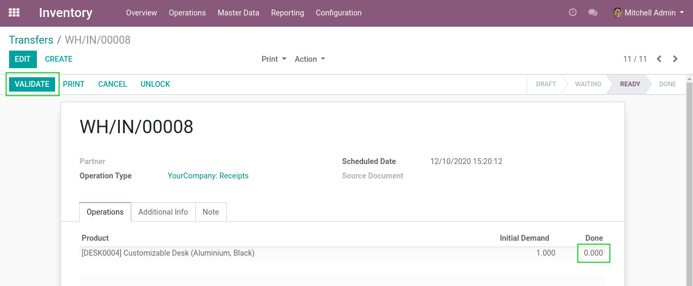
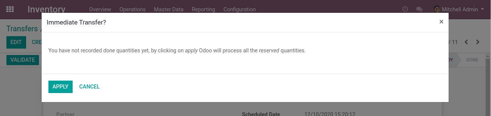
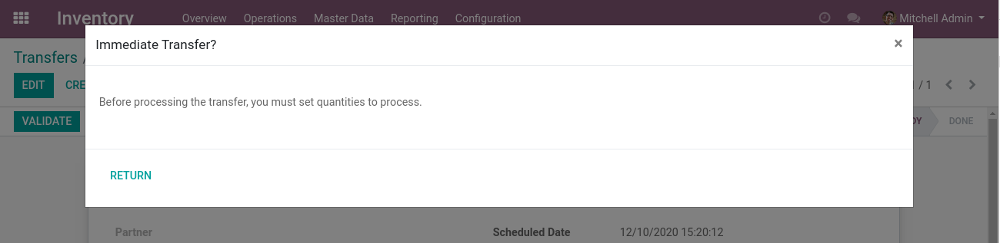
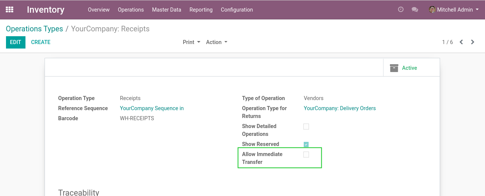

Stock Immediate Transfer Disable
================================

.. contents:: Table of Contents

Context
-------
In vanilla Odoo, if you click to validate a transfer, the system will propose to set
all quantities to done.

This behavior is problematic because it causes errors of distraction.

Overview
--------
This module disable the feature. If you click on the Validate button on a picking,
there will be a blocking message if no quantities are set on the picking.

This feature is configurable for each picking type.

On the picking type form, you may check the field 'Allow Immediate Transfer' to enable or disable the feature for this type of picking.

Contributors
------------
* David Dufresne (david.dufresne@savoirfairelinux.com)

More information
----------------
* Module developed and tested with Odoo version 10.0
* For questions, please contact our support services
(support@savoirfairelinux.com)
