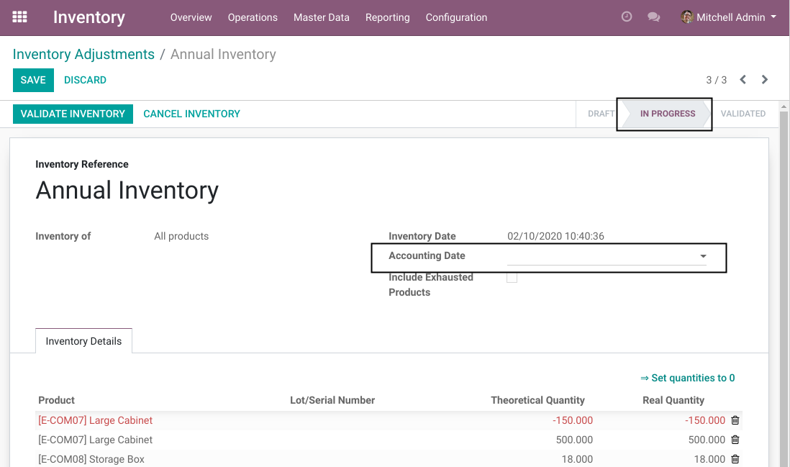

Stock Inventory Accounting Date Editable
===================================
This module makes the accounting date editable on confirmed inventory adjustments.

.. contents:: Table of Contents

Context
-------
In vanilla Odoo, the accounting date of a confirmed inventory adjustment is read-only.

Usage
-----
Go to a confirmed inventory adjustment.

Not that the field editable at the ``In Progress`` state.

Contributors
------------
* Numigi (tm) and all its contributors (https://bit.ly/numigiens)
