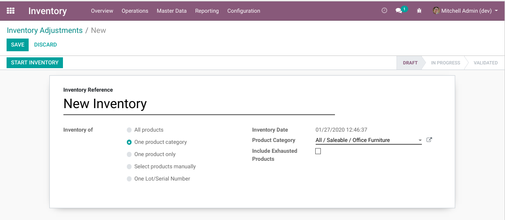
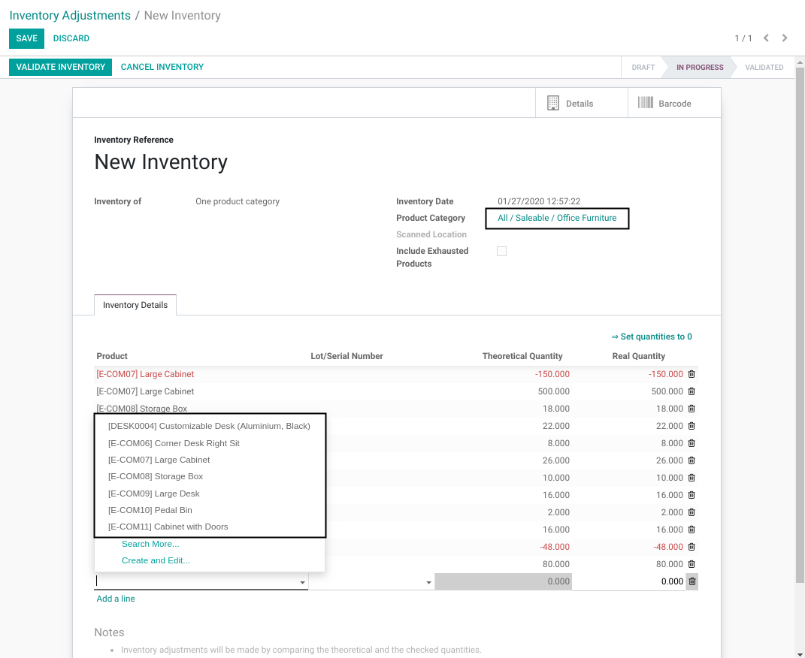

Stock Inventory Line Product Domain
===================================
This module adds a domain filter to the selection of products on inventory adjustment lines.

.. contents:: Table of Contents

Context
-------
In vanilla Odoo, on an inventory adjustment, you may choose to process an inventory per product category.
However, a user may manually add a line with a product that does not belong to the category.
The problem is the same when running an inventory for a single serial number.

Usage
-----
As member of ``Inventory / User``, I create an inventory adjustment for a single category of product.

After starting the inventory, when adding a new line,
I notice that the selection of products is restrained to the selected category.

Filter by Lot / Serial Number
-----------------------------
When running an inventory for a single lot/serial number, only the product linked to this lot is selectable.

Inventory Validation
--------------------
When validating the inventory, a blocking message will be shown if an inventory line does
not match the selected parameters on the inventory adjustment.

Contributors
------------
* Numigi (tm) and all its contributors (https://bit.ly/numigiens)
