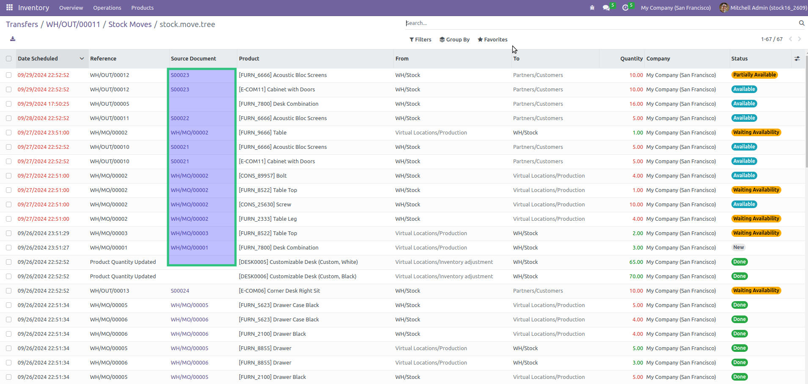
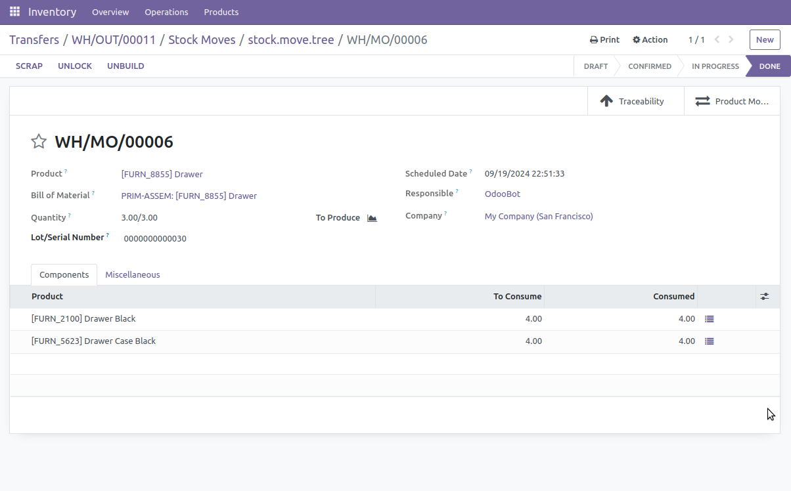
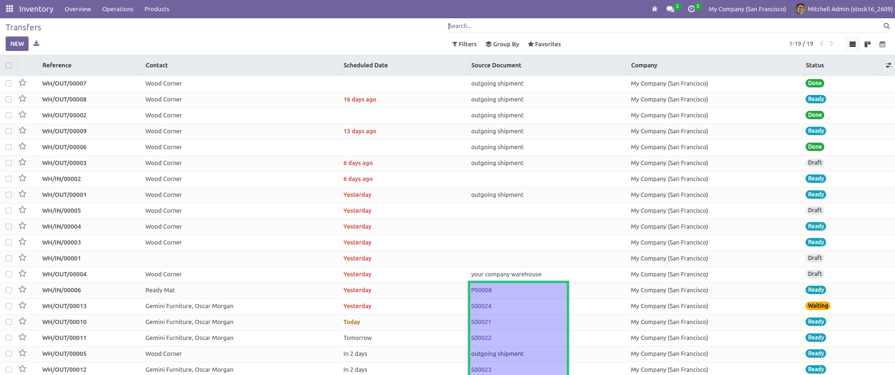
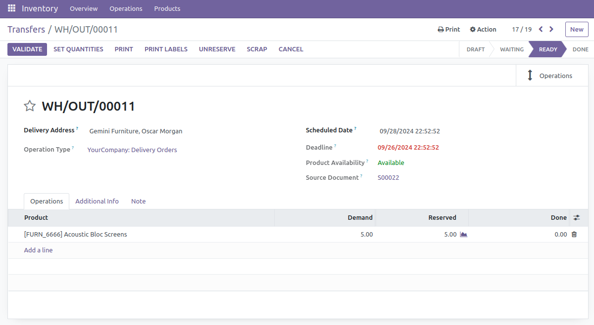
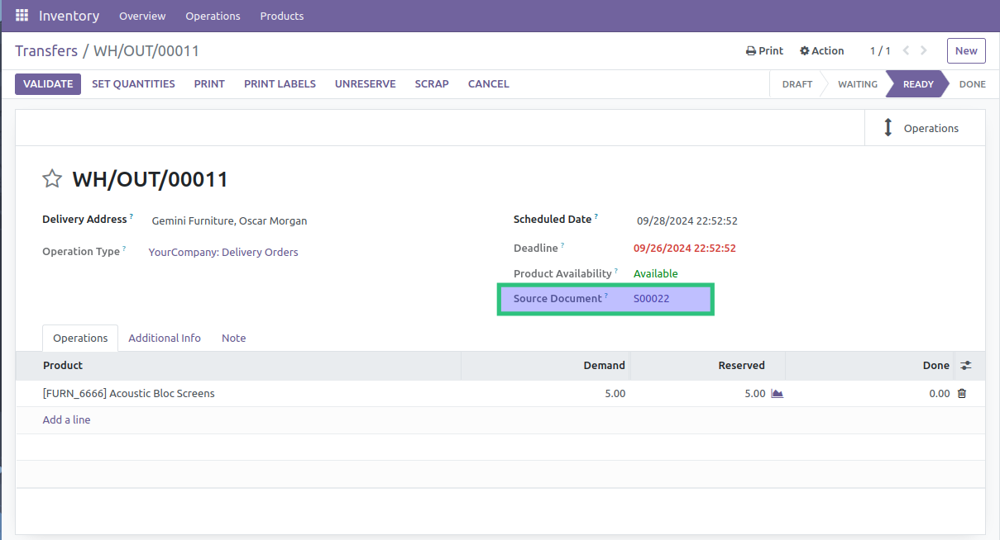

====================================
Stock Move Origin Link
====================================

This module adds the `Source Document` to the list view of stock pickings and stock moves.

The text is clickable if it refers to an object within the supported types.

For example, in the example above, when clicking on `MO/00003`, the user is redirected to the
form view of the production order.

Stock Pickings
--------------
The feature is available for all stock picking list views.
Here is an example with the list view of delivery orders.

When clicking on `SO020`, the user is redirected to the sale order.

Form Views
----------
The feature is also available on form views of stock pickings and stock moves.

Supported Origin Documents
--------------------------
The module supports the following documents as origin of a stock move:

* Sale Orders
* Purchase Orders
* Manufacturing Orders

However, the module only depends on the `Inventory` app. It detects automatically whether the `Sales`, `Purchases` and `MRP` apps are installed.

Contributors
------------
* Numigi (tm) and all its contributors (https://bit.ly/numigiens)

More information
----------------
* Meet us at https://bit.ly/numigi-com