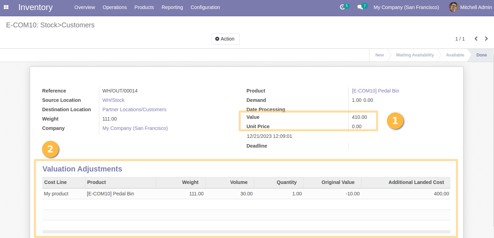

Stock Move Valuation Adjustment
===============================

.. contents:: Table of Contents

Context
-------
In vanilla Odoo, it is hard to keep track of the landed costs that impact
the value of a stock move.

The required information not shown in the form view.

Overview
--------
This module adds extra elements to the form view of a stock move.

1. The total value and unit price
2. The valuation adjustments (landed costs)

Contributors
------------
* Numigi (tm) and all its contributors (https://bit.ly/numigiens)
