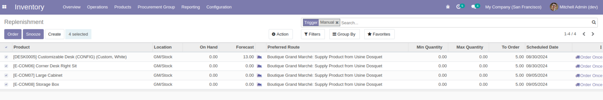
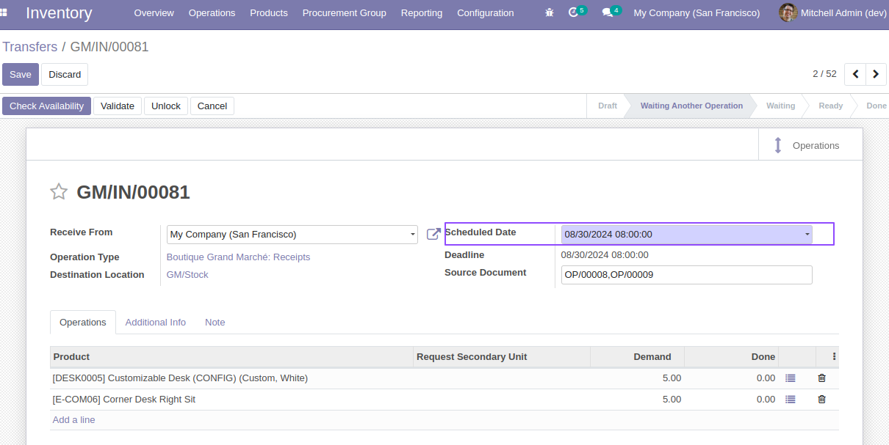
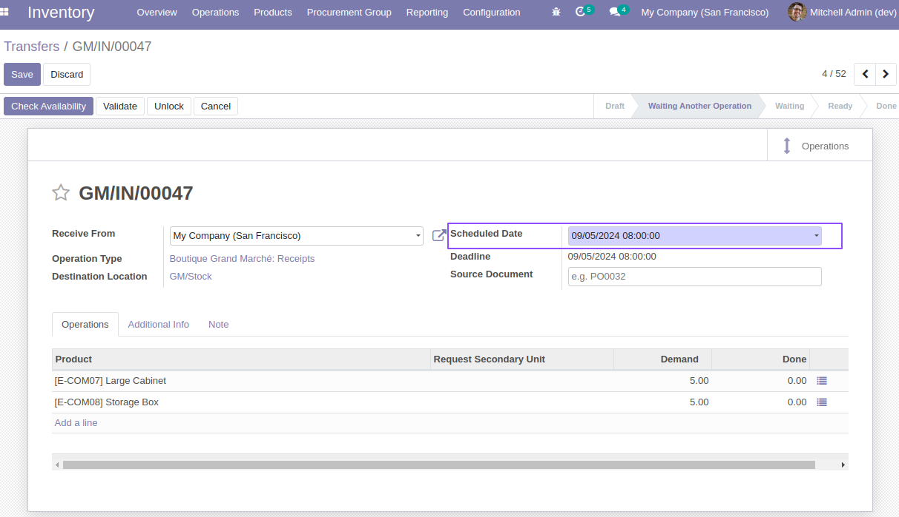
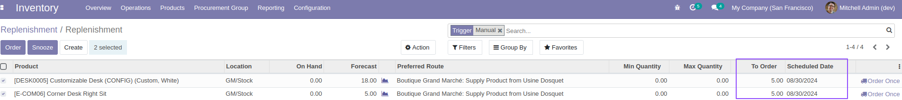
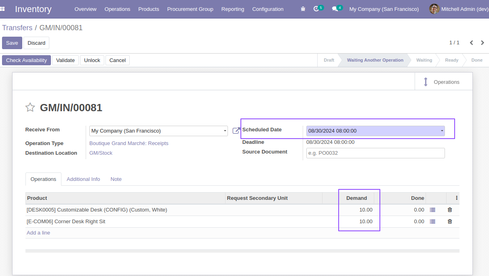

Stock Orderpoint Picking Groupby Date
=====================================

.. contents:: Table of Contents

Context
-------

This module allows to create a picking grouped by procurement scheduled date.
This module depends of `stock_orderpoint_scheduled_date <https://github.com/Numigi/odoo-stock-addons/tree/14.0/stock_orderpoint_scheduled_date>`_ module that's allow to set manuelly a replanishement date for procurement.

Usage
-----

As a user with access right to ``Inventory > Operations > Replenishment``, 
I select at least 2 lines and assign them different expected dates and then order:

I then go to the list of picking and I see that 2 pickings have been created.
- The expected date of the first is 08/30/2024 and the expected date of the second is 09/05/2024.
- Each picking contains the list of products ordered for that date.

If I place a new order on the same date, my new order must be added to the same picking of this date.

Contributors
------------
* Numigi (tm) and all its contributors (https://bit.ly/numigiens)
