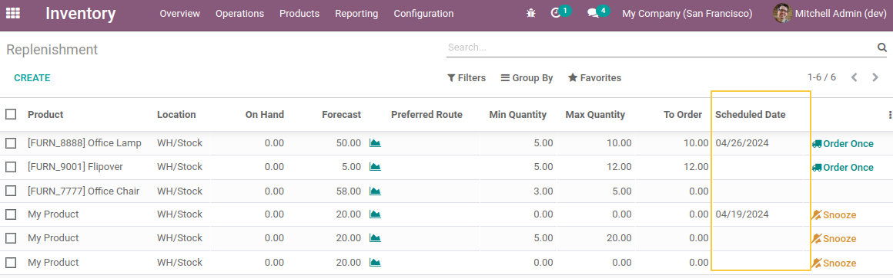
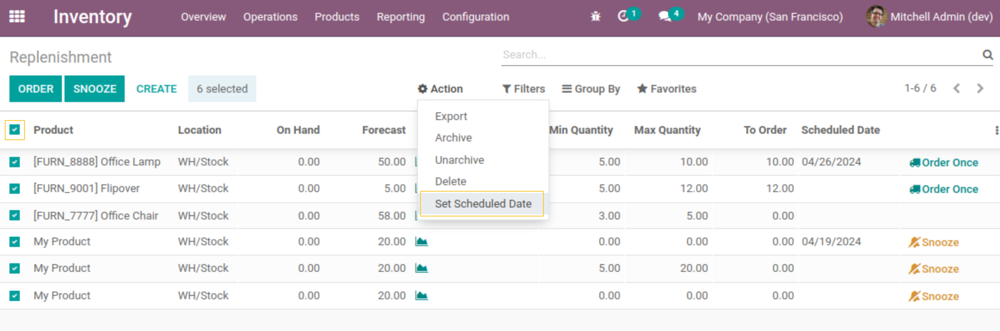
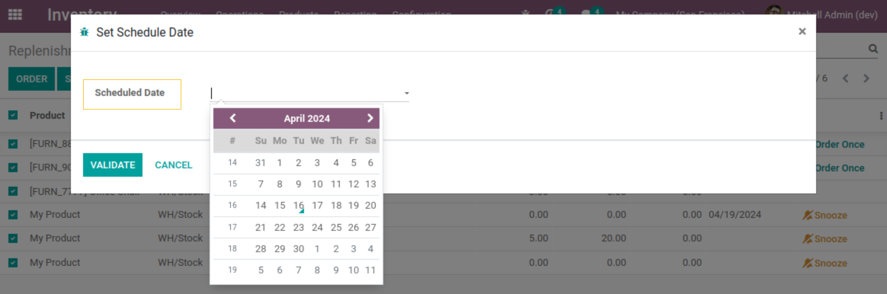

Stock Orderpoint Scheduled Date
===============================

.. contents:: Table of Contents

Context
-------

This module allows user to set a scheduled date manuelly to replanish stock.

Description
-----------
As a user with access right to `Inventory > Operations > Replanishment`, I can see a new field in the list view:

You can assign in mass the Scheduled Date to a selection of records using the server action `Set Scheduled Date`:

Contributors
------------
* Numigi (tm) and all its contributors (https://bit.ly/numigiens)
