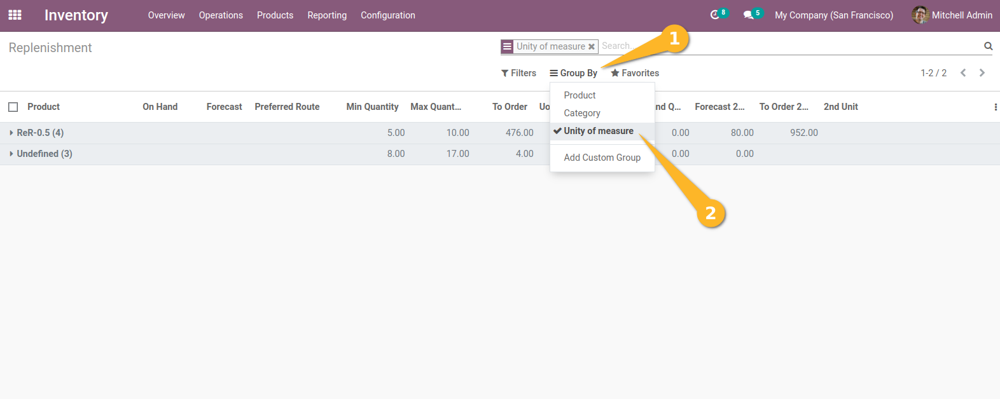

Stock Orderpoint Secondary Unit
===============================
This module allows to use secondary unit on order and group replenishment lines by primary unit of measure.

Usage
-----
As an Inventory user, I access the replenishment view from `Inventory > Operations > Replenishment`.

.. image:: static/description/replenishment_menu.png

I see that the following new fields are available on the view:
-On Hand Qty 2nd Unit
-Forecast 2nd Unit
-To Order 2nd Unit : available in custom filters and grouping.
-2nd Unit: available in custom filters and grouping.

.. image:: static/description/new_secondary_uom_fields.png

*Order in secondary unit*

When a quantity to order is indicated by the system in the `To order` field, 
I notice that the `To order 2nd unit`` field also contains the order proposal in the secondary unit for the inventory.

.. image:: static/description/to_order_convertion.png

When I change the quantity `To order 2nd unit`, I notice that the system automatically converts and fills the `To order` field and vice versa.

In other words, I can enter the quantity to order in one of the 2 units, and automatically the quantity is calculated in the other unit.

*Group by Unit of Measure*

I notice that a new grouping pre-defined by `Unit of measure` is present.

Contributors
------------
* Numigi (tm) and all its contributors (https://bit.ly/numigiens)
