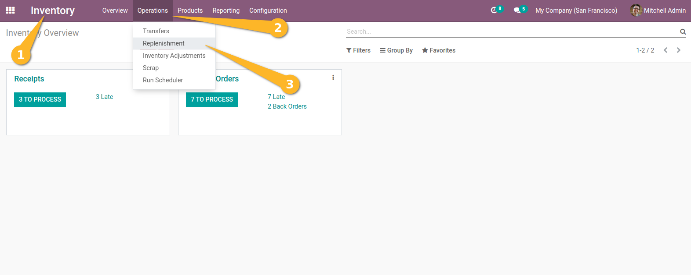
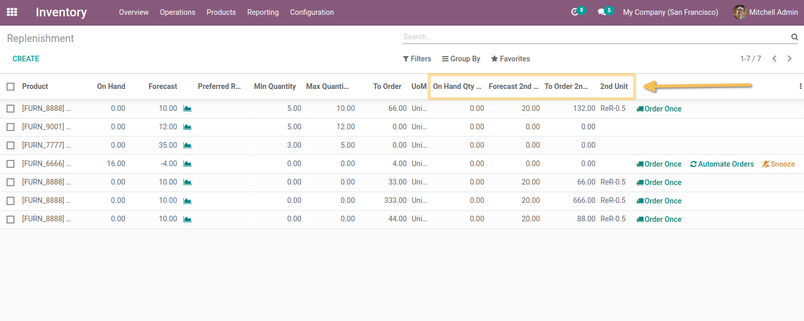
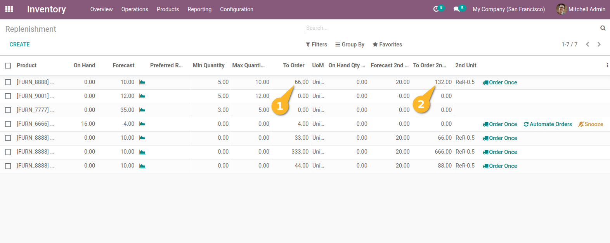

Stock Orderpoint Secondary Unit
===============================
This module extends the functionality of stock orderpoint to allow order products in secondary unit.

Usage
-----
As an Inventory user, I access the replenishment view from `Inventory > Operations > Replenishment`.

I see that the following new fields are available on the view:
-On Hand 2nd Unit
-Forecast 2nd Unit
-To Order 2nd Unit.
-2nd Unit.

*Order in secondary unit*

When the 'To order' quantity is filled, The 'To order 2nd unit' wiil be automatically updated.

When I adjust the quantity in the `To order 2nd unit`, the system automatically converts and populates the `To order` field.

The ``On Hand 2nd Unit`` and ``Forecast 2nd Unit`` fields are automatically  computed using the ``Secondary Uom``, the ``On Hand Qty`` and ``the Forecast Qty`` values.

*Group by Unit of Measure*

This module adds a new group by entry: `Unit of measure`.

Contributors
------------

The `Numigi <https://numigi.com/r/home>`_ team is the contributor to this project. We help Quebec companies implement Odoo and Konvergo ERP.