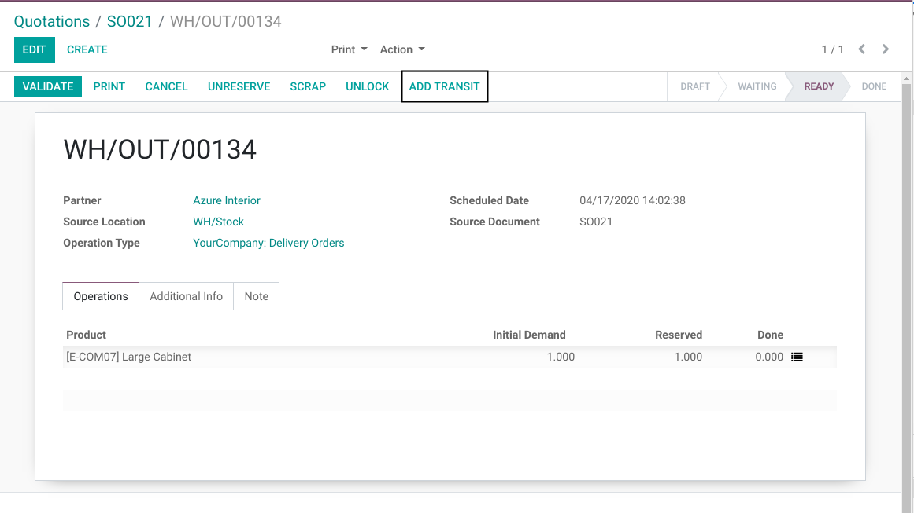
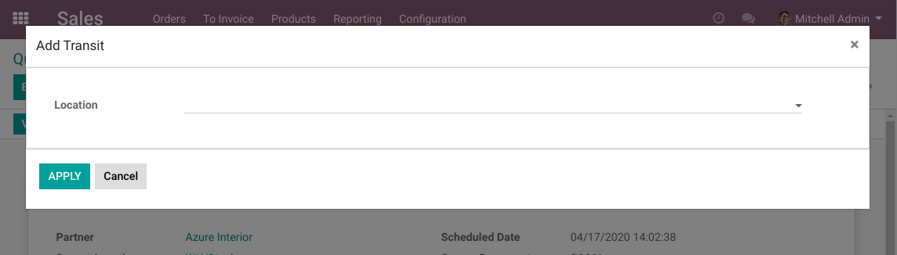
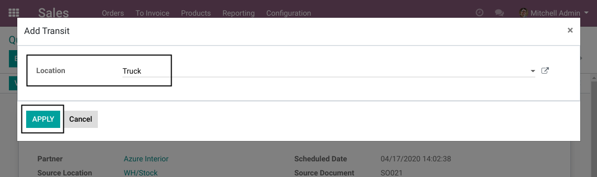
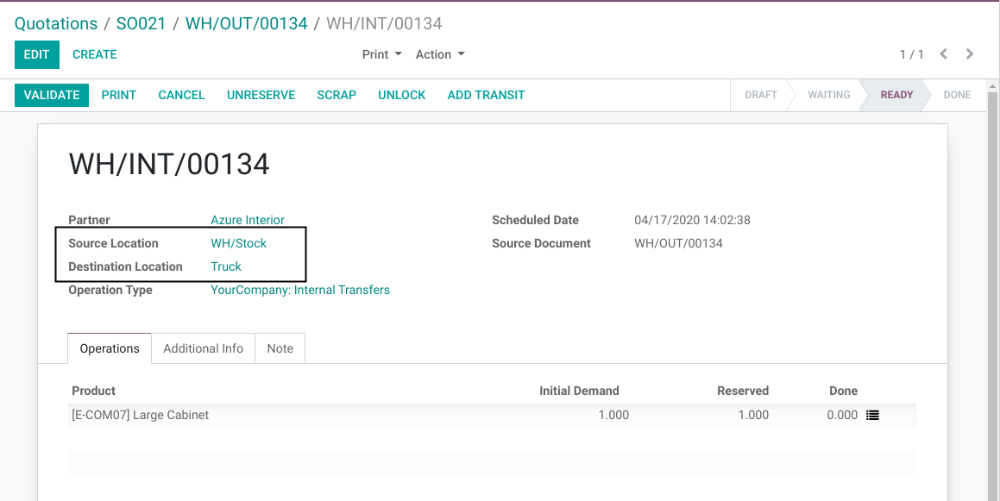
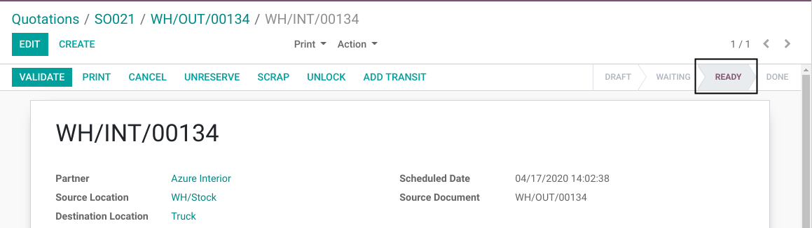
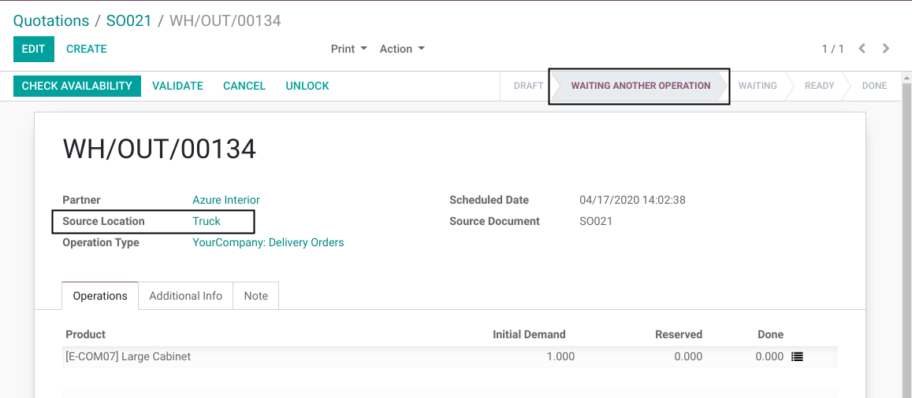
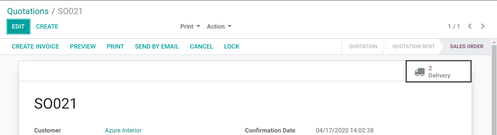
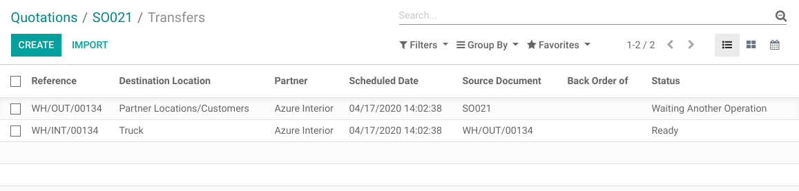
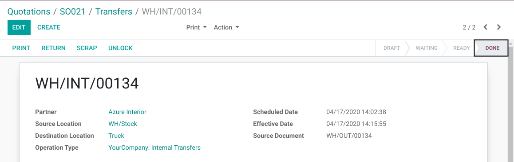
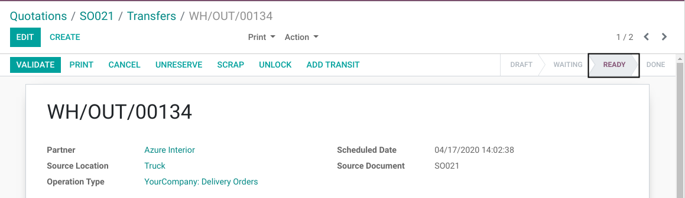

Stock Picking Add Transit
=========================
This module allows to add a transit to an existing stock operation.

.. contents:: Table of Contents

Context
-------
In vanilla Odoo, routes have rigid structures.
For example, when delivering to a customer from a warehouse, you must use each operation defined in your delivery route.

This module mitigates this issue.
It allows to dynamically insert an internal transfer into your delivery / receipt steps for a given order.

Usage
-----
As member of the group ``Stock / User``, I go to the form view of a delivery order.

I notice a new button ``Add Transit``.

A wizard is opened.

I select my transit location, then I click on confirm.

A new internal transfer is created with the following values:

* Source Location: Stock
* Destination Location: Truck

I notice that this new picking is ``Ready``.

Back to the delivery order, I notice that it is waiting for another operation.

Also, the source location was changed to ``Truck``.

On the sale order, I notice that I have 2 related operations.

I validate the transfer from Stock to Truck.

Then, the delivery order is ready.

Module Design
-------------
A transit can be added to any operation.

However, depending on the type of operation, the new picking is either added before or after the existing one.
In either case, the nature of the existing picking is not changed by the transit.

Outgoing / Internal Operations
~~~~~~~~~~~~~~~~~~~~~~~~~~~~~~
The behavior is the same for outgoing and internal operations.

The new transit picking is added ``Before`` the existing picking.

Reserved Quantities
*******************
If quantities (detailed operations) are already reserved on the existing picking, they are transfered to the new picking.

Therefore, you do not need to unreserve quantities before adding the transit.

Incoming Operations
~~~~~~~~~~~~~~~~~~~
When adding a transit to an incoming operation (i.e. from ``Suppliers`` to ``Stocks``),
the new picking is added ``After`` the existing operation.

Dropship
~~~~~~~~
Dropship operations are handled as incoming operations.

Contributors
------------
* Numigi (tm) and all its contributors (https://bit.ly/numigiens)
