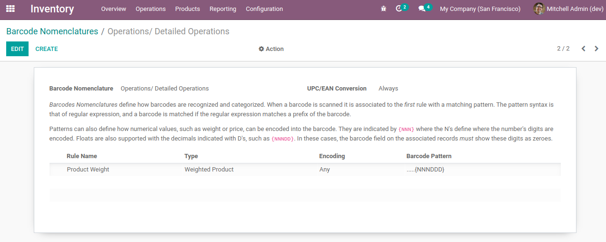
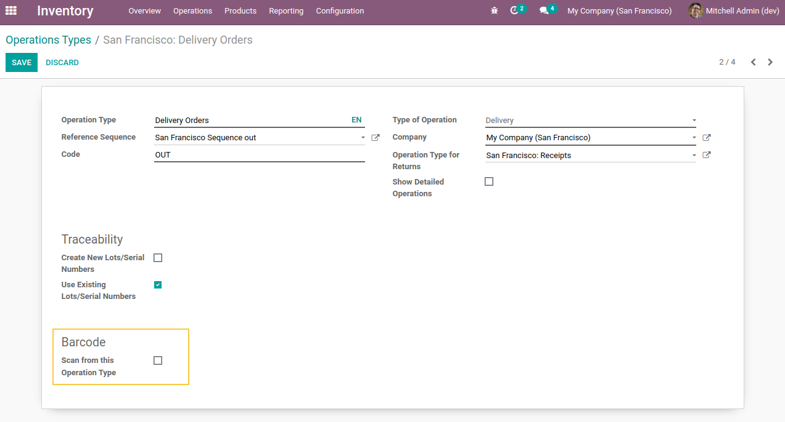
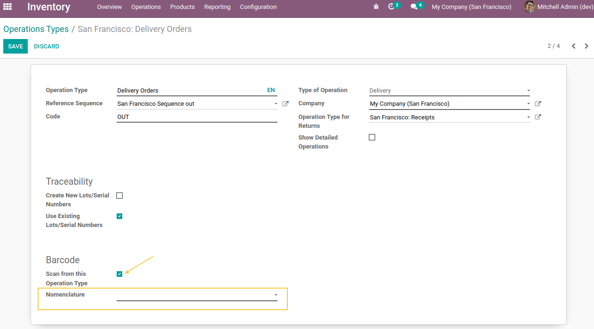
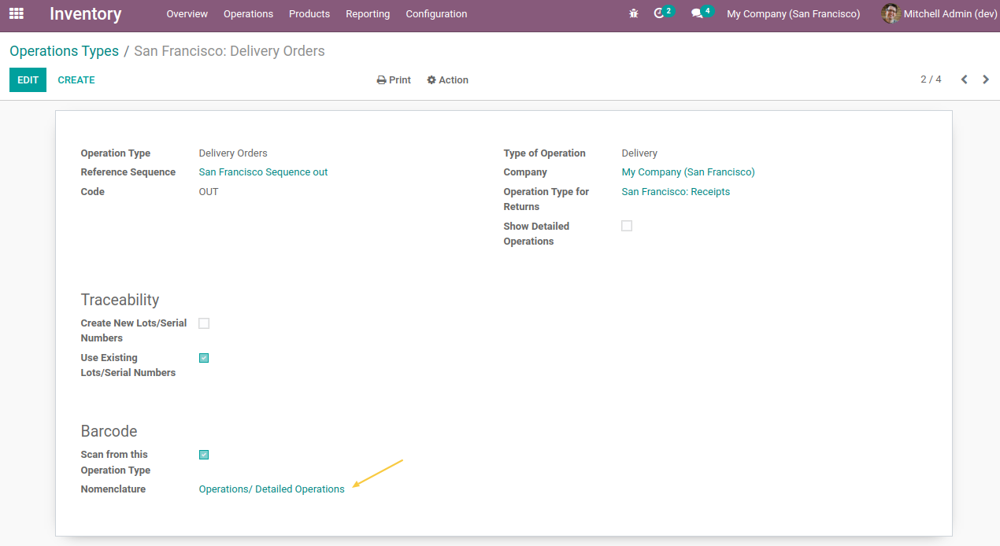
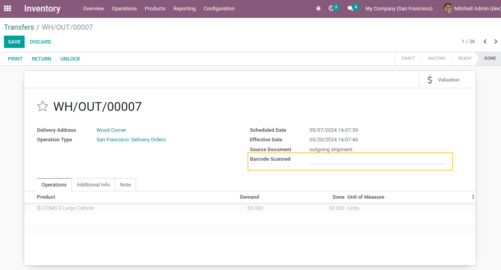
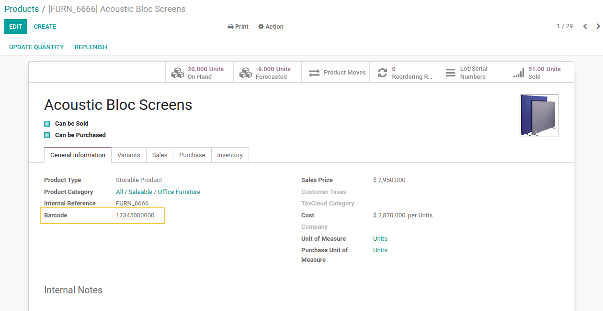
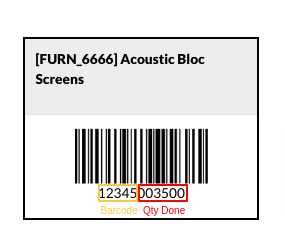
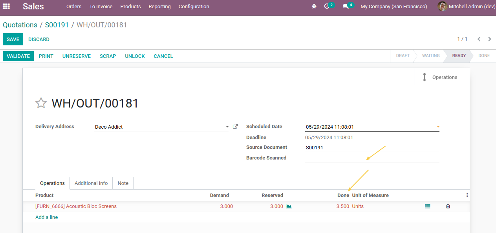

Stock Picking Barcode
=====================

Context
-------
The module adds a field on pickings which allows you to scan the barcode and fill in the fields using the information contained in the barcode.

Settings
---------

1- New barcode nomenclature
~~~~~~~~~~~~~~~~~~~~~~~~~~~
As a member of the `Inventory / Administrator` group, I go to the `Inventory application > Configuration > Barcode nomenclatures`
and I see that a new barcode nomenclature `Operations/Detailed Operations` is present.

This nomenclature defines the structure of the barcode which must be decoded during scanning from an inventory operation.

2- Configuration on operation types
~~~~~~~~~~~~~~~~~~~~~~~~~~~~~~~~~~~

As a member of the `Inventory / Administrator` group, I go to the form view of an Operation Type and I see that a new field `Scan from this Operation Type` is added.

When I check the box, I see that the Barcode Nomenclature field appears.
This field is required.

3- Configuration on delivery order
~~~~~~~~~~~~~~~~~~~~~~~~~~~~~~~~~~

As a member of the `Inventory / Administrator` group, I go to the form view of the "Delivery Order" operation type and I check the Scan from this operation type box.

I then select the nomenclature "Operations/Detailed Operations" and save.

Usage
-----

As an Inventory user, I go to a delivery Order and see that a new Scan field is available.

For this exemple my product has the following barcode:

I click on Edit, then on the Check availability button (if the quantities are not yet reserved) to create the detailed operation lines.
I then click in the Scan field and scan the following barcode for my product.

I see that the Done fields is populated from the information in the barcode and the Scan field is empty so I can scan again.

Contributors
------------

The `Numigi <https://numigi.com/r/home>`_ team is the contributor to this project. We help Quebec companies implement Odoo and Konvergo ERP.