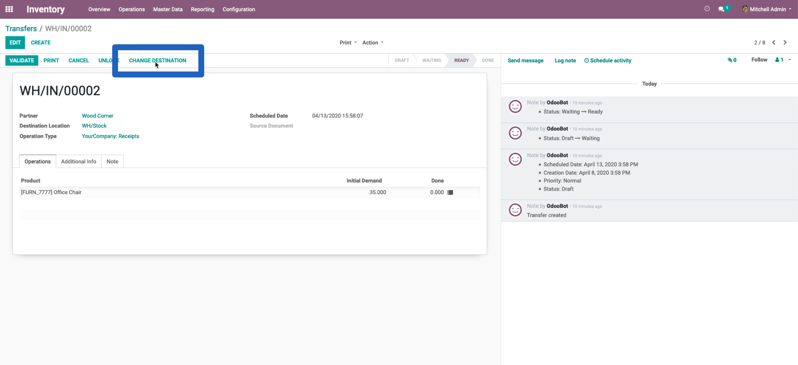
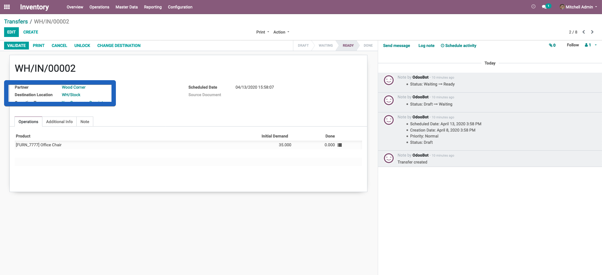
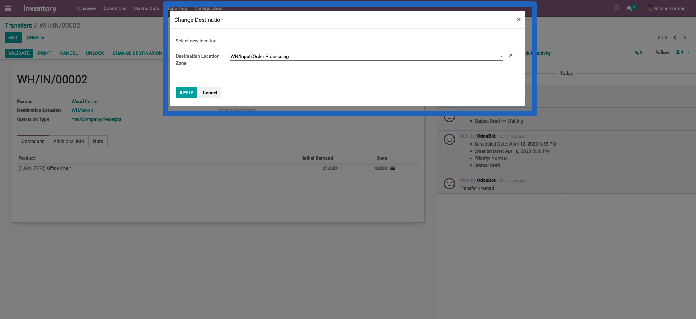
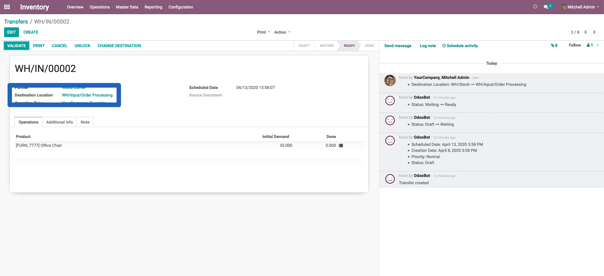
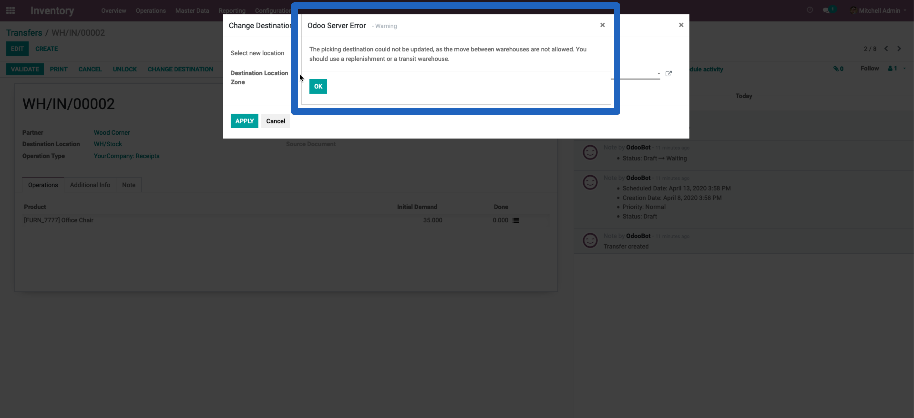

Stock Picking Change Destination
================================

The module allows to change the destination of a picking.

When I go to an inventory transfer, now I can see on stock picking ready
a new button.

The new button opens a wizard that will help me to change the destination of a picking.

In this picking, for example, the initial destination is

I click on the button, the wizard is opened. I can pick a new destination.

Once I clicked apply, I can see the destination changed.

Constrains
----------

The picking's destination update is under two constrains

1. The new destination has to be in the warehouse.
2. The picking cannot have any following picking.

Warning will be raised if the change hits any of these cases.

Here is an example displaying the warning during the first case

Contributors
------------
* Numigi (tm) and all its contributors (https://bit.ly/numigiens)
