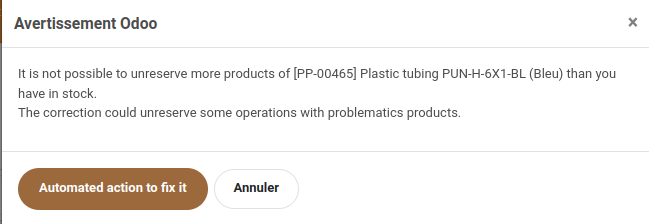
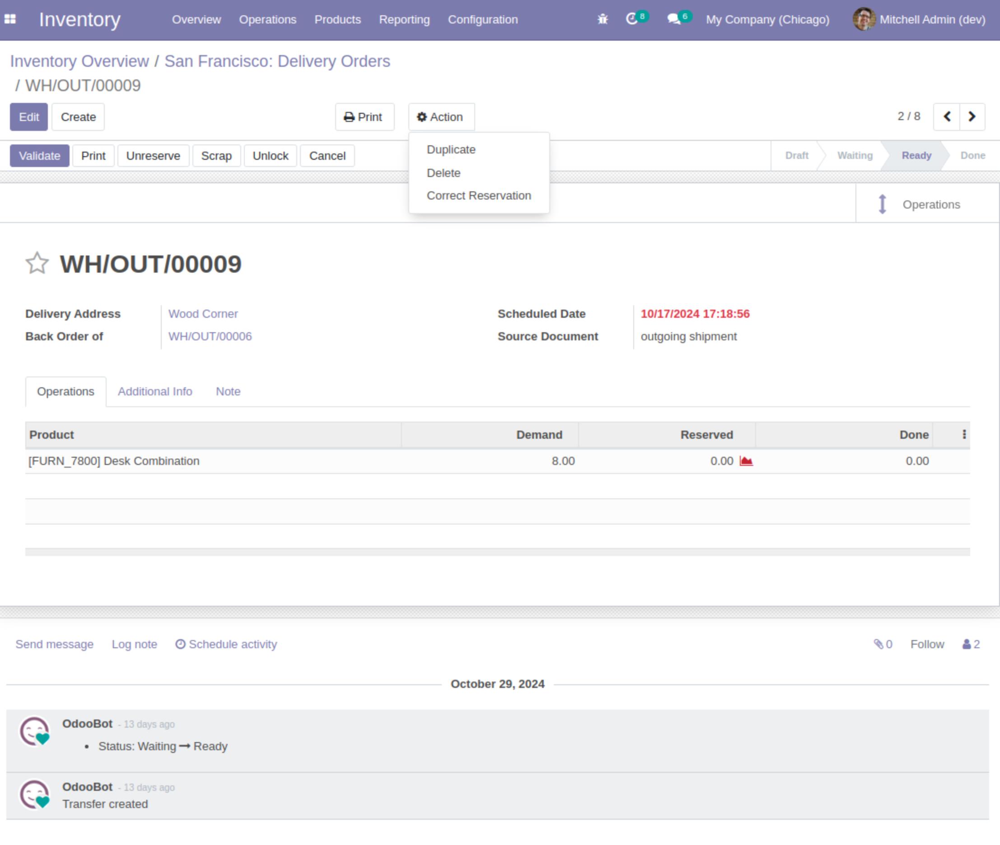
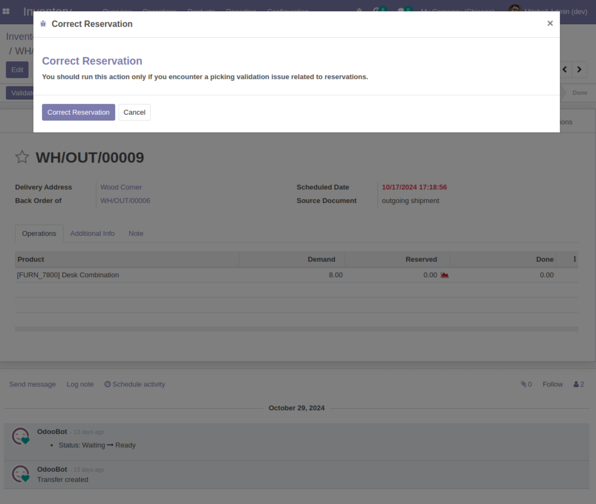

Stock Picking Correct Reservation
=================================

Context:
~~~~~~~~
Odoo provides a server action called 'Correct inconsistencies for reservation' to correct problematics products.
This action could unreserve stock.

This action is executed only by users with group ``Administration``.

We want to give access to users with group ``Inventory / Administrator``, to be able to execute this action. 

Description:
~~~~~~~~~~~~

This module allows to execute the same code of 'Correct inconsistencies for reservation' action from picking.

Usage
-----
As a user with access group ``Inventory / Administrator``, I receive the warning bellow while validating a transfer:

I need to go to ``Action`` button and click on ``Correct Reservation``

The action will show a popup to correst reservation. 
The correction may unreserve the quantities of the selected transfer lines.

Contributors
------------

The `Numigi <https://numigi.com/r/home>`_ team is the contributor to this project. We help Quebec companies implement Odoo and Konvergo ERP.