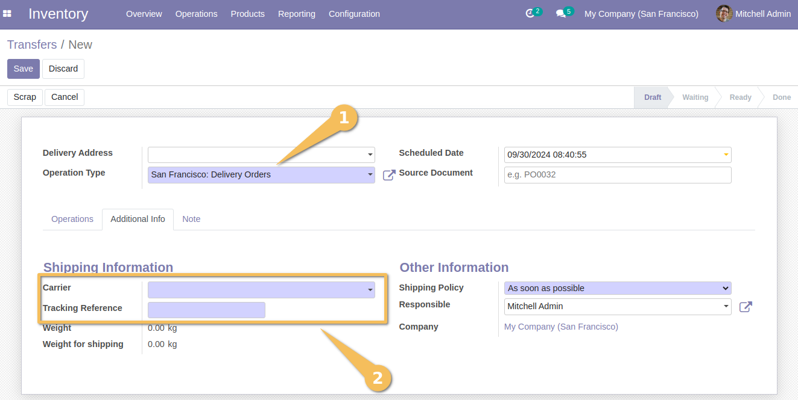

=======================================
Stock Picking Delivery Carrier Required
=======================================

This module forces users to systematically inform the `Carrier` and the `Tracking reference` about the delivery.

Usage
-----

As a user with "Inventory/User" access, I am verifying a delivery. This is carried out in two stages:

1. Picking

I validate a picking (operation type is not delivery) without encountering an error message, 
knowing that the `Carrier` and `Tracking Reference` fields are not mandatory at this step.

.. image:: static/description/shipping_info_not_mandatory.png.png

2. Delivery

I note that at the delivery level, the two fields `Carrier` and `Tracking Reference` are mandatory:

Contributors
------------
* Numigi (tm) and all its contributors (https://bit.ly/numigiens)
