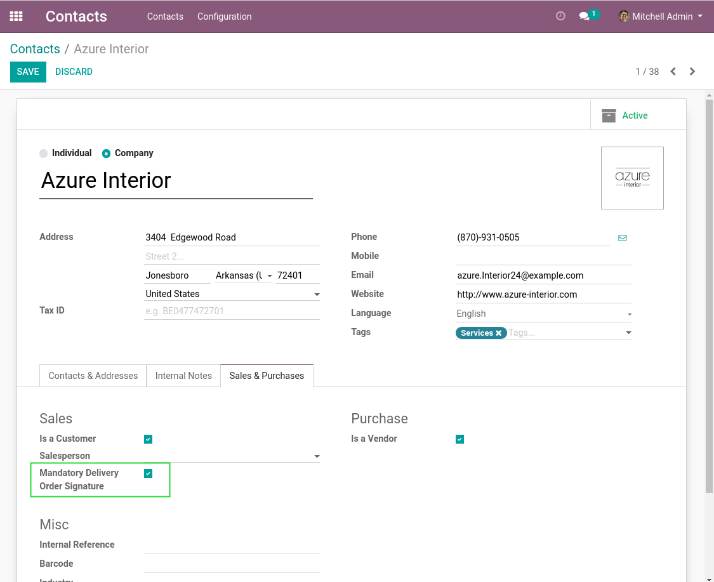
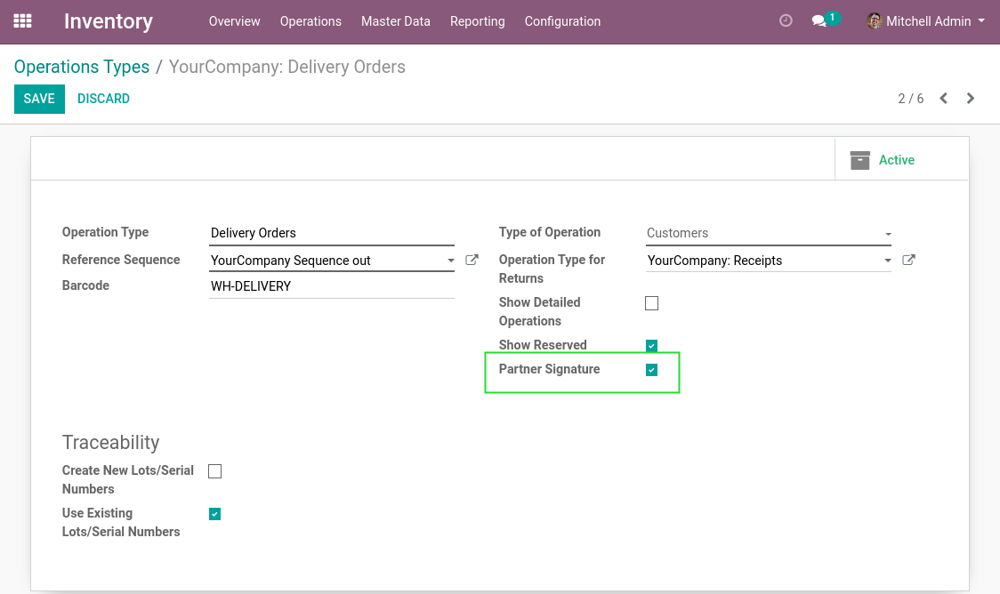
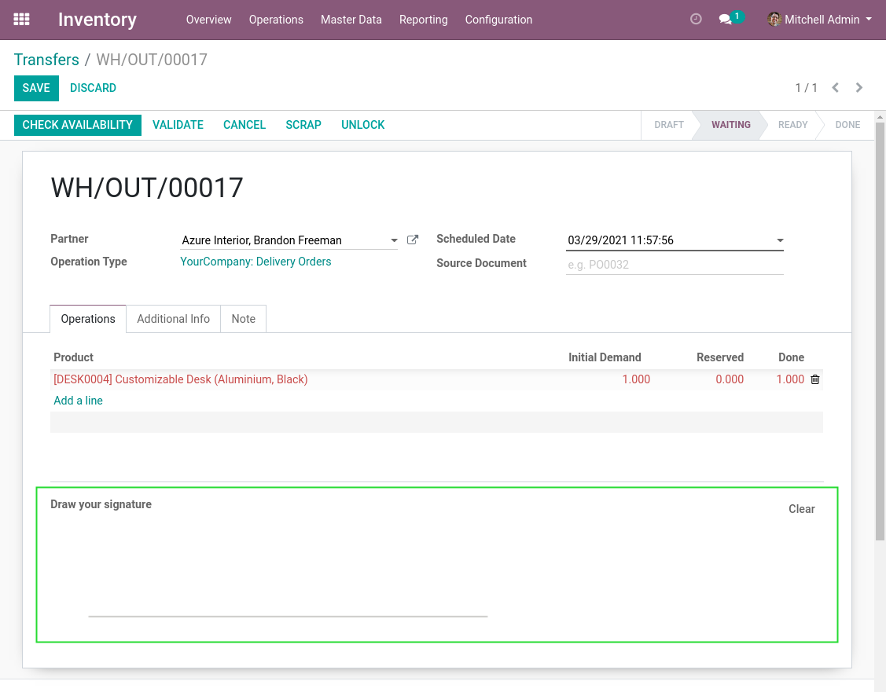
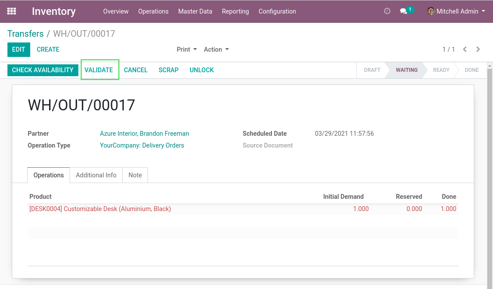
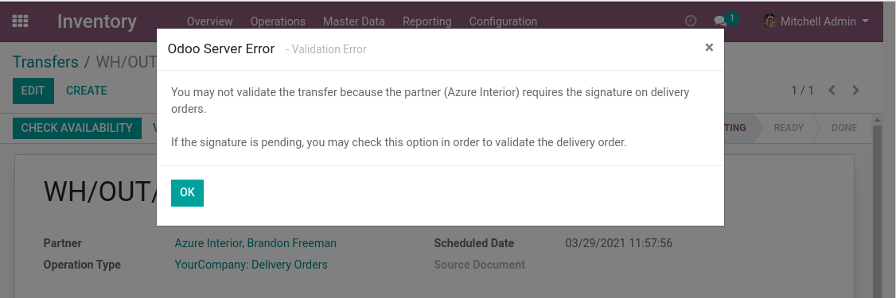
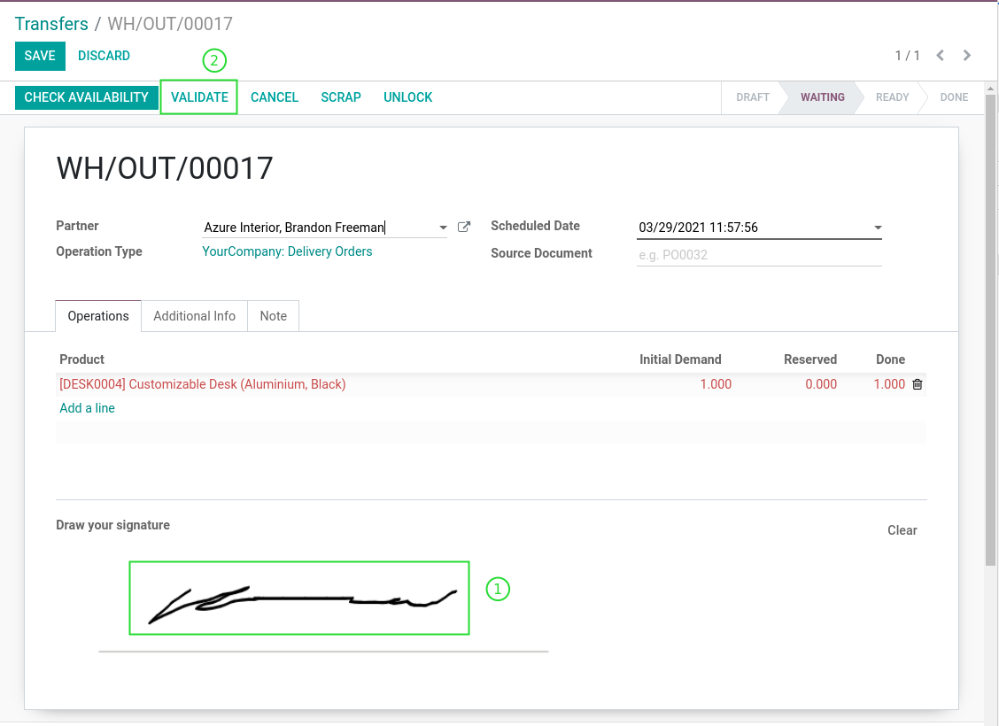
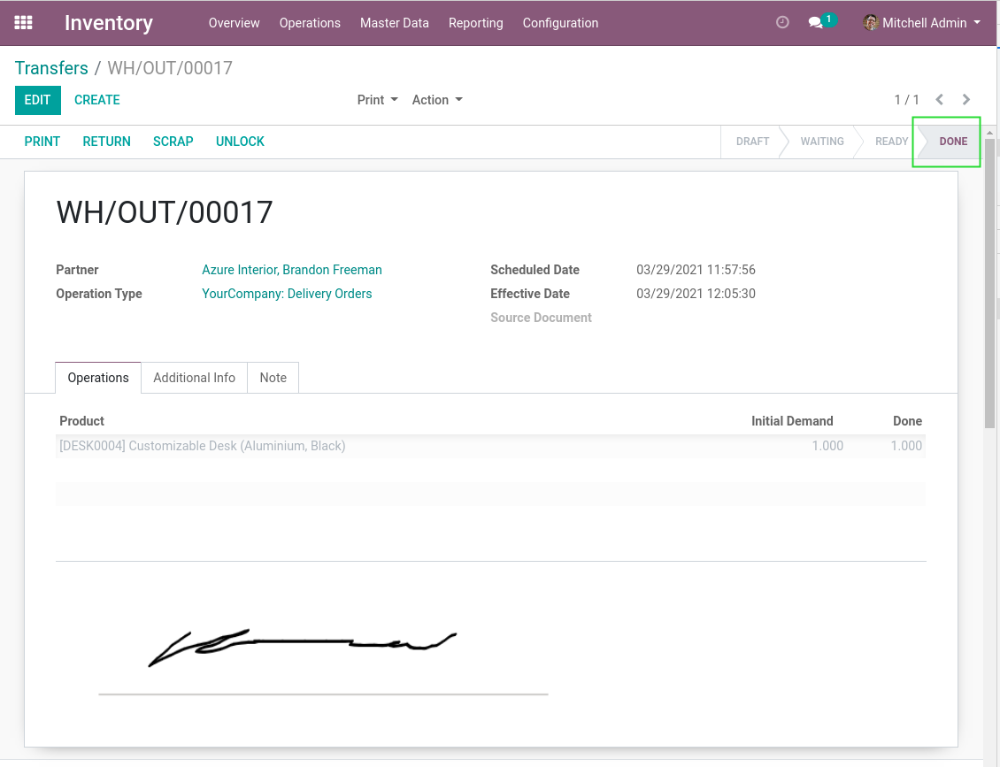
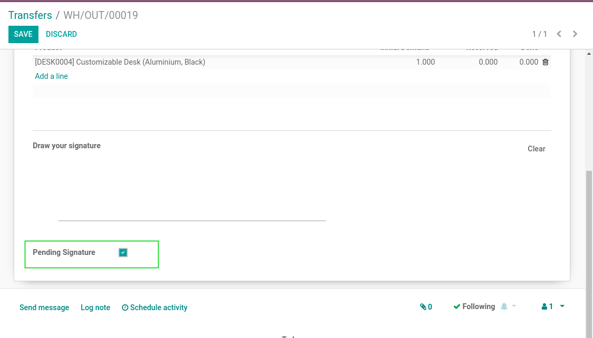

Stock Picking Digitized Signature
=================================

This module allows to sign a delivery order.

.. contents:: Table of Contents

Context
-------
The module `web_widget_digitized_signature <https://github.com/OCA/web/tree/12.0/web_widget_digitized_signature>`_
adds a widget to sign a document directly in form view.

Configuration
-------------

Partners
********
I go to the form view of a customer.

I notice a new checkbox ``Mandatory Delivery Order Signature``.

If this box is checked, the signature is mandatory for any delivery done for this partner
(or any of its contacts/addresses).

Picking Types
*************
I go to the form view of a picking type.

I notice a new checkbox ``Use Partner Signature``.

When this box is checked, the partner signature will be enabled for this type of operation.

By default, after installing the module, this box is checked on delivery orders.

Usage
-----
As member of the group ``Stock / User``, I go to the form view of a delivery order.

I notice a new widget allowing the customer to sign the document (using a tablet for example).

I validate the delivery order without signing.

A blocking message appears.

This message appears because the signature is mandatory for this customer.

I sign the document, then validate the picking.

The picking is validated without error.

Pending Signature
*****************
Alternatively, instead of signing the picking, I can check the box ``Pending Signature``.

This box allows to validate a picking although the document could not be signed already.

Contributors
------------
* Numigi (tm) and all its contributors (https://bit.ly/numigiens)

More information
----------------
* Meet us at https://bit.ly/numigi-com
