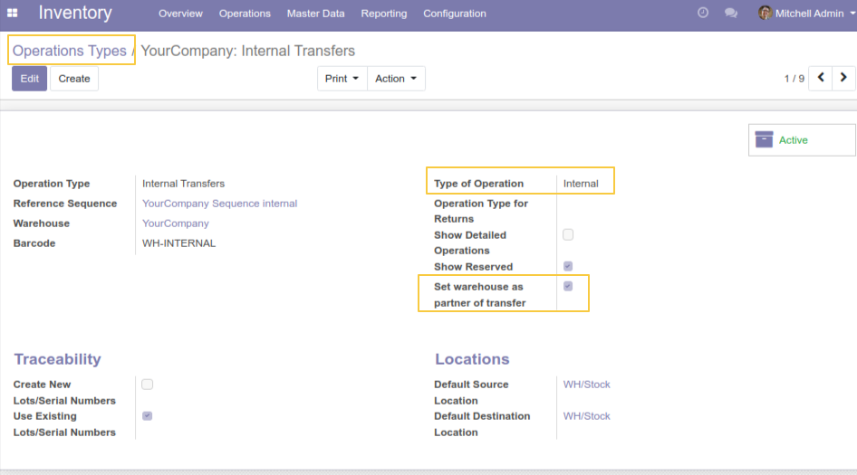
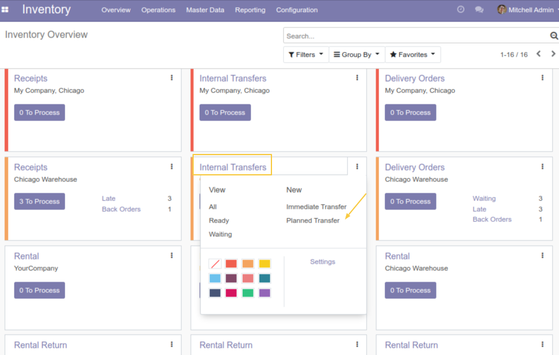
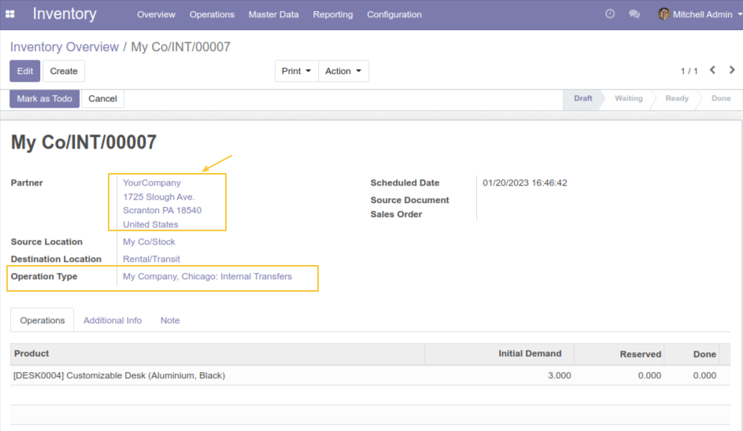

Stock Picking Internal Partner
==============================

.. contents:: Table of Contents

Context
-------
When adding a transit-type transfer, the partner on the transfer takes the warehouse address of the destination location.

Also, this need spreads for internal transfers created manually or from a replenishment rule.

Be able to configure the propagation of the warehouse address from the transfer operations types.

Configuration
-------------

As a user with the Inventory Manager right, I go to the `Inventory / Configuration / Operations Types` menu.
I see a new checkbox `Set warehouse address as partner of transfe` is added to the form view of `Internal` type operations.

This checkbox is checked by default on all internal types of operations when installing the module.

Usage
-----

As a user with the Inventory User right, I go to `Inventory / Overview`
I choose `Internal Transfers`, then I click on `Planned Transfer` button.

I create the internal transfer and I save.
I see that the partner field takes the address of the warehouse associated with the destination location.

To keep the native behavior of the address mentioned on the partner for certain types of internal operations,
you must uncheck the option "Set warehouse address as partner of transfer"

Contributors
------------
* Numigi (tm) and all its contributors (https://bit.ly/numigiens)

More information
----------------
* Meet us at https://bit.ly/numigi-com
