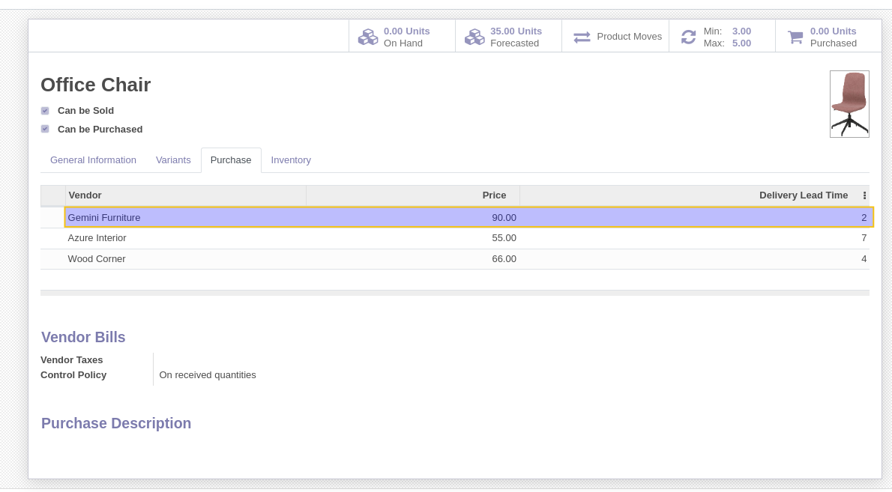
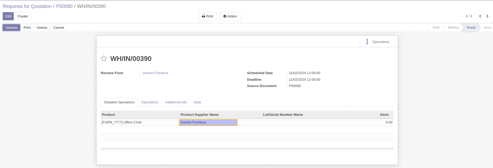
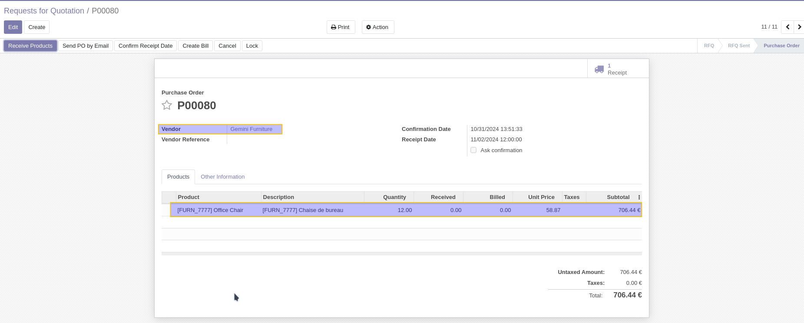

Stock Picking Product Supplier
==============================

This module enhances the functionality of the stock module, adding the supplier reference information on stock move lines during incoming receipts.

Table of Contents
-----------------
- Overview
- Configuration
- Usage
- Contributors

Overview
--------
The ``Stock Picking Product Supplier`` module displays the supplier reference for products on stock move lines specifically during receipt operations. This supplier reference is automatically retrieved based on the supplier associated with the incoming transfer.

When handling incoming receipts, users will see a new field on each stock move line displaying the relevant supplier reference. This field is visible only on transfers of type "Receipt" and pulls information from the supplier reference set in the Purchase tab of the product form.

Configuration
-------------
To configure this feature, navigate to the Purchase tab on the product form view. Here, you can specify the supplier reference, which will then display on stock move lines during receipt operations.

Usage
-----
During the processing of an incoming receipt, the supplier reference for each product will be shown on its respective stock move line. This helps users quickly reference supplier information directly within the receipt view.

Contributors
------------
* Numigi (tm) and all its contributors (https://bit.ly/numigiens)
