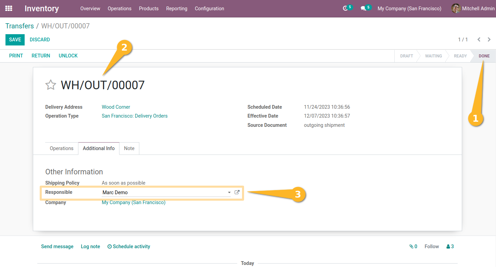

Stock Picking Responsible Editable
==================================
This module allow to have the ability to update the `Responsible` when an outgoing/internal transfer status is “Done”.

Usage
-----
As a user with access to product transfers, I access a “pack”, “pick” or “delivery” type operation whose status is “Done”.
When I click on “Edit” I see that the `Responsible` field is editable.

Contributors
------------
* Numigi (tm) and all its contributors (https://bit.ly/numigiens)
