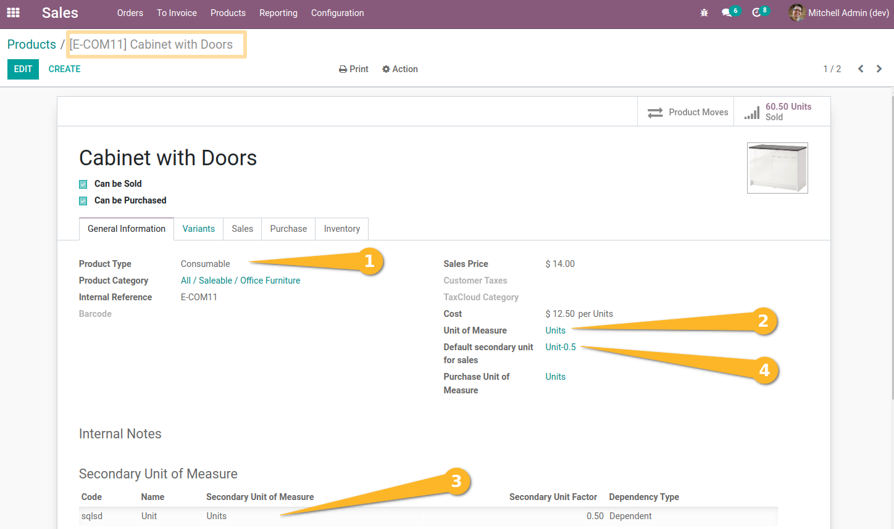
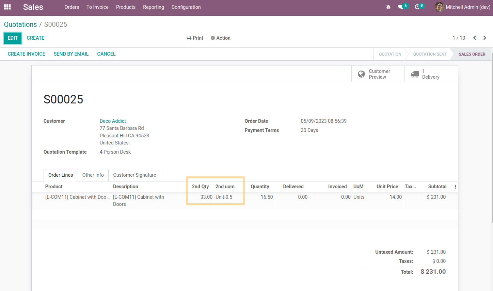
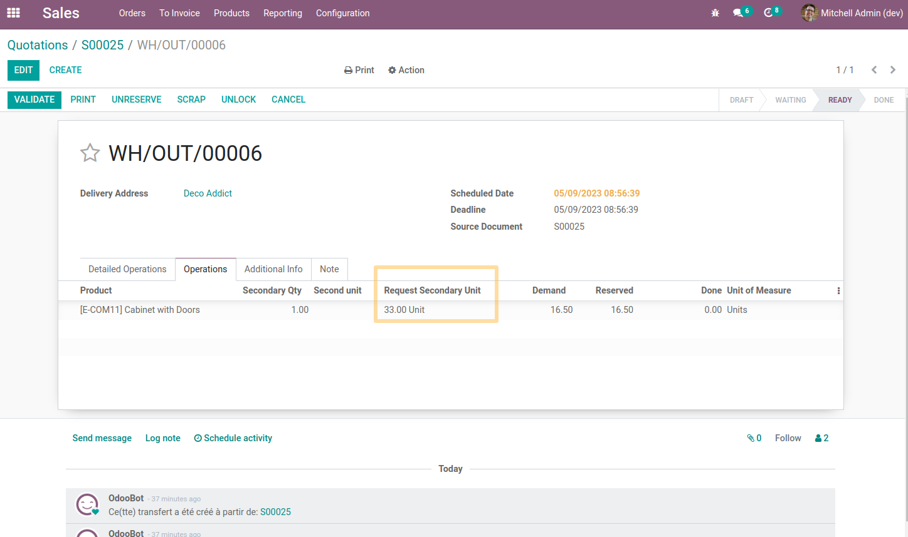

Stock Picking Secondary Unit Demand
===================================
Shows (on the lines of the delivery note and on the stock movements) the quantity ordered by the customer in the 2nd unit of measurement (i.e. in units).

Usage
-----
> Item configuration required (standard stock_secondary_unit)

* Item Type: Stockable or Consumable
* Unit of measurement: Defined
* Secondary measurement unit: Defined (dependent or not)
* Secondary Unit of Measure for Sales: Defined

As a Sales user, I create and confirm a sale for 5 units* of ``My Great Item``.
``The unit represents the secondary unit of measurement on my item``.

> Information dissemination ``Request secondary unit``

As an Inventory user, I go to the delivery slip generated from my sale.

I see that the quantity (in the secondary unit of measure) as well as the name of the secondary unit of measure are displayed in the new field.

I find this information on operations, detailed operations as well as stock movements.

When the 2nd Qty and 2nd uom fields on the sales line are not filled in, then the Secondary unit request field on the delivery line will be empty.

Contributors
------------
* Numigi (tm) and all its contributors (https://bit.ly/numigiens)

More information
----------------
* Meet us at https://bit.ly/numigi-com
