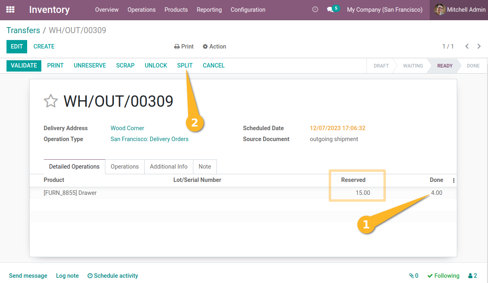
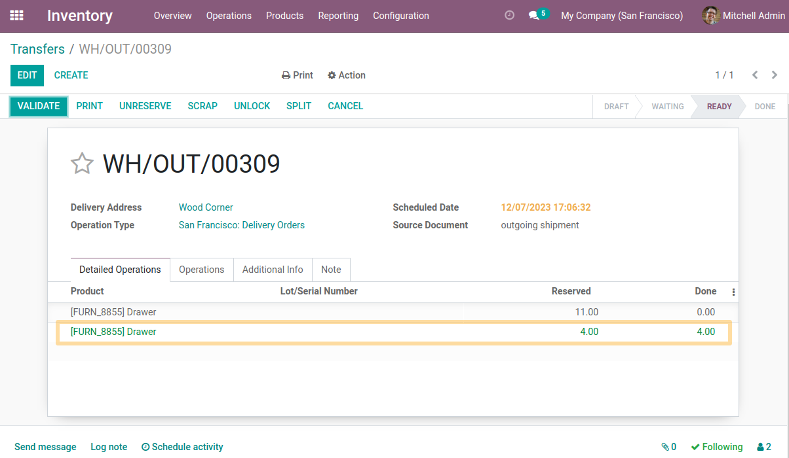
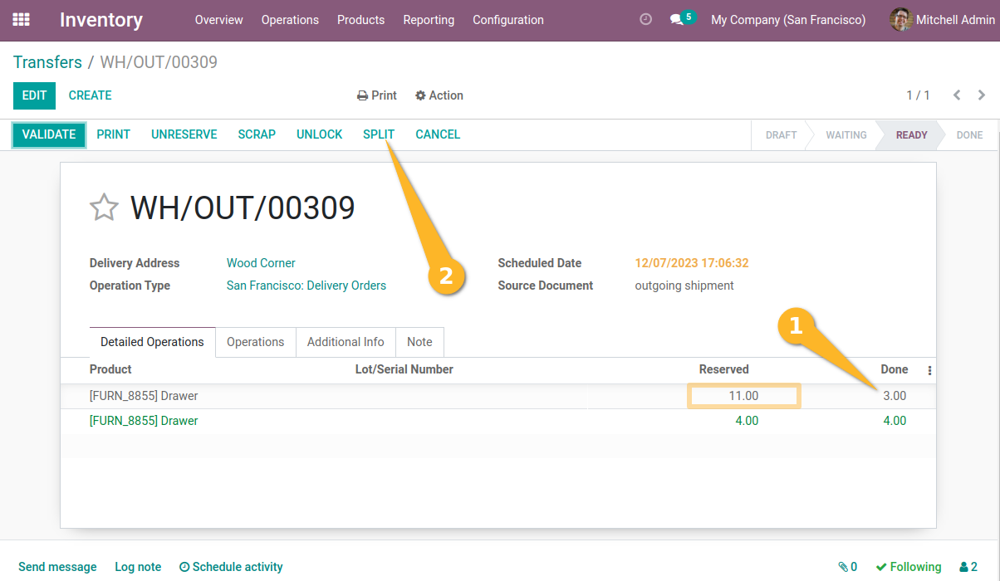
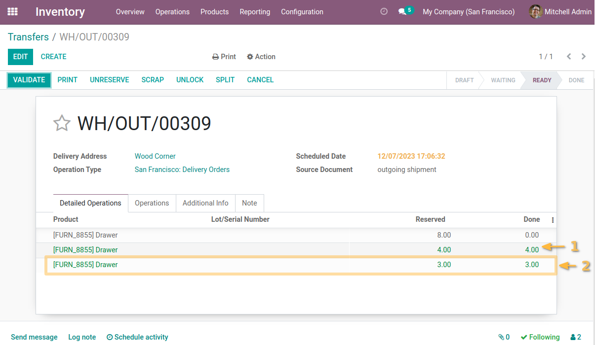

Stock Picking Split Quantity
============================
This module allows to split the quantities reserved on the outgoing transfer in order to facilitate the packing operation.

Usage
-----
As a user with inventory access, I access the outgoing transfer form view to prepare the merchandise.
I notice a new `Split` button.
If I click on the button and no quantity made is mentioned then nothing happens.
I enter the quantities to divide in the `Done` column and click on `Split`.

I notice that 2 lines are divided with the quantity done mentioned.

Then I'll try splitting the units for a second time.

When I click `Split`, the previously split rows will not be impacted.

Contributors
------------
* Numigi (tm) and all its contributors (https://bit.ly/numigiens)
