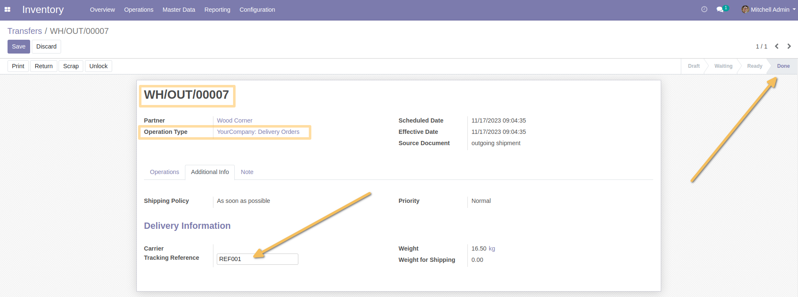
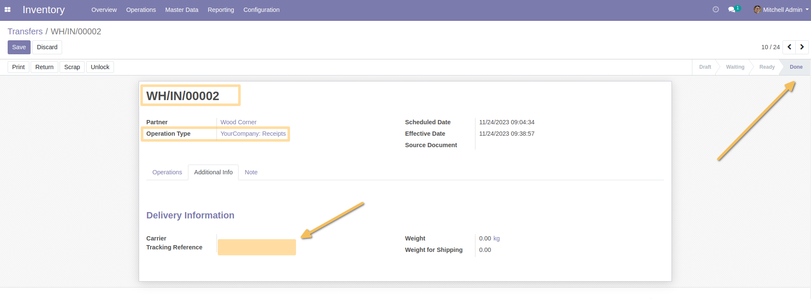

Stock Picking Tracking Reference
================================
This module allow to have the ability to enter the `Tracking reference` when the transfer status “out” = “Done”.

Usage
-----
As a user with access to transfers, I access an "out" type delivery whose status is "Done".
When I click on "Edit", I see that the `Tracking reference` field is editable.

For other transfer, the field is on readonly mode when the transfer is with "Done" or "Cancel" status.

Contributors
------------
* Numigi (tm) and all its contributors (https://bit.ly/numigiens)
