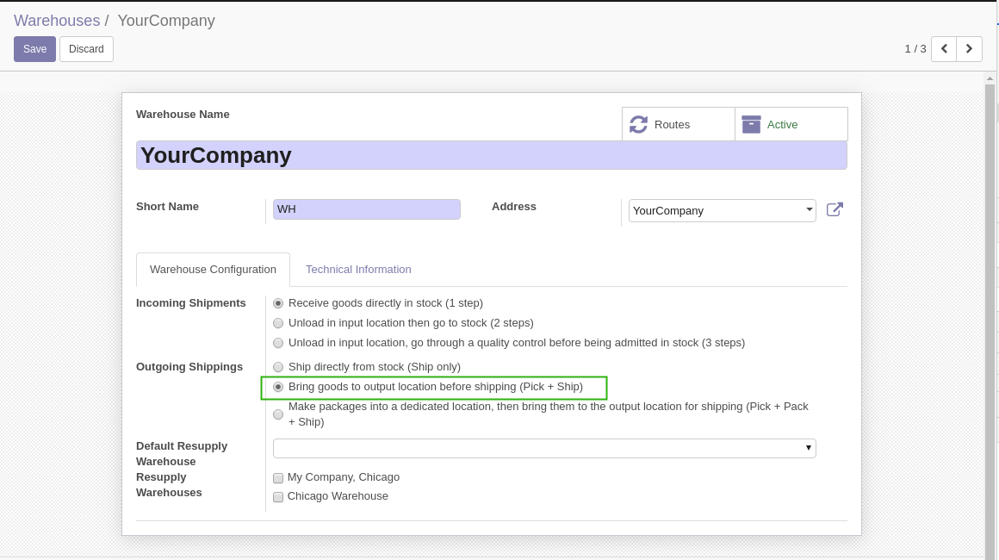
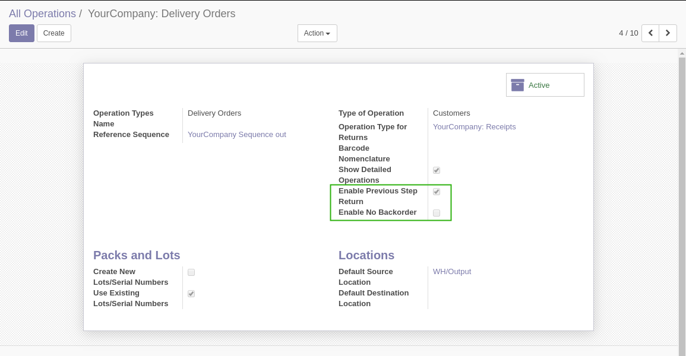
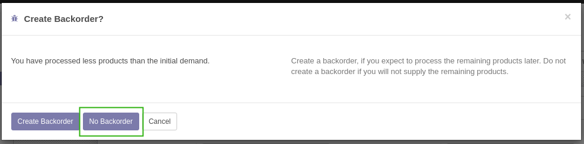
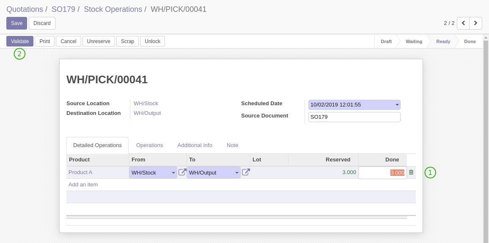
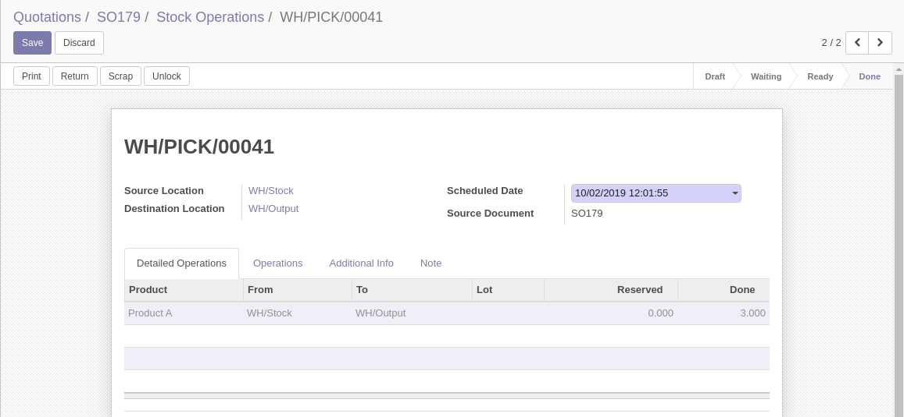
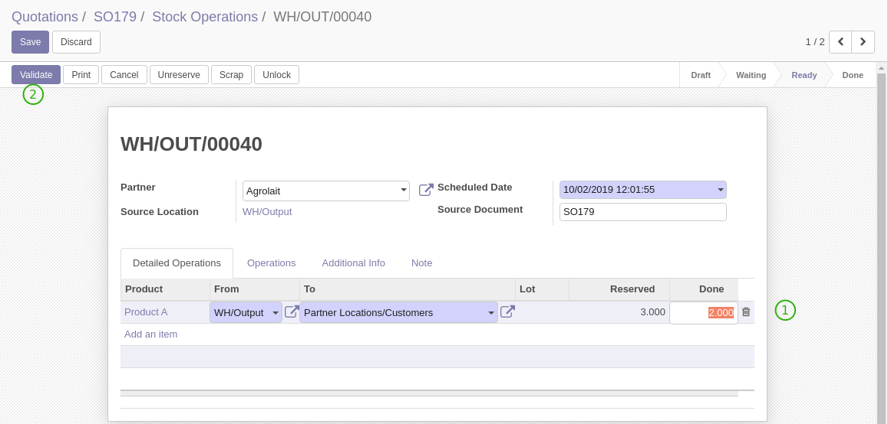
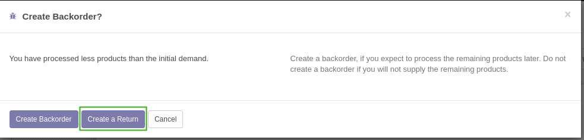
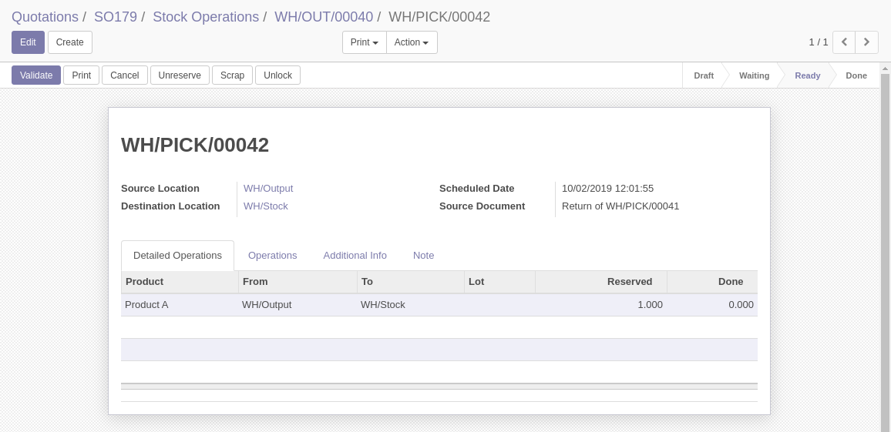

Stock Previous Step Return
==========================
This module allows to automatically generate a stock picking return when validating a further step.

.. contents:: Table of Contents

Context
-------
In vanilla Odoo, per warehouse, you may choose to process your stock operations in one or multiple steps.

For example, the delivery route offers 3 options:

1. Ship Only
2. Pick + Ship
3. Pick + Pack + Ship

With multiple steps, you may end up with the following issue.

* All products have been processed on the first step.
* At the second step, for some reason, the full quantities may not be processed.

After partially processing the picking, you need to:

* Navigate through menus and find the first step picking.
* Manually create a return from this first step.

This is very error prone and not much convenient for the user.

Summary
-------
In the above case, it would be more convenient for the user to simply generate a stock return
when validating the second step.

When asked whether to create a ``Back Order``, the user would instead choose to return the products
to their original location.

This is what the module offers.

Configuration
-------------

Warehouse
~~~~~~~~~
As member of ``Stock / Manager``, I go to the form of my warehouse.

I select the ``(Pick + Ship)`` route for delivering.

Delivery Step
~~~~~~~~~~~~~
I go to the ``Delivery`` picking type related to the ``(Pick + Ship)`` route.

I notice 2 new checkboxes.

Enable Previous Step Return
***************************
Checking this box displays the ``Create a Return`` button on the backorder confirmation wizard for this type of operation.

.. image:: static/description/return_products_button.png

Enable No Backorder
*******************
Checking this box displays the ``No Backorder`` button on the backorder confirmation wizard for this type of operation.

Usage
-----

Pick Step
~~~~~~~~~
As member of the group ``Stock / User``, I process a ``Pick`` operation.

I select the quantity, then I validate the picking.

Ship Step
~~~~~~~~~
Later, when the order is ready to ship, I go to the related ``Delivery Order``.

.. image:: static/description/ship_operation_ready.png

Now, let's suppose that, since the ``pick`` step was done, my customer called and asked to ship only 2 of the 3 items.

I fill the quantity to ship, then I click on ``Validate``.

A wizard is opened, asking whether to ``Create a Backorder`` or ``Create a Return``.

I click on ``Create a Return``.

A new stock picking is open.

This picking is a return operation of the initial ``Pick`` operation.

Advanced Use Cases
------------------
The module supports serial numbers and production lots.

It also supports the case where there are multiple ``Pick`` operations related to the ``Ship`` operations.
As much as possible, the module will generate a single return operation.
However, it may in some edge cases create more than one return pickings.

Known Issues
------------
For now, this module does not support 3-steps routes, such as ``Pick + Pack + Ship``.
The reason is that supporting this case would add extra complexity to the module.
This is not currently required by any of Numigi's clients.

Contributors
------------
* Numigi (tm) and all its contributors (https://bit.ly/numigiens)

More information
----------------
* Meet us at https://bit.ly/numigi-com
