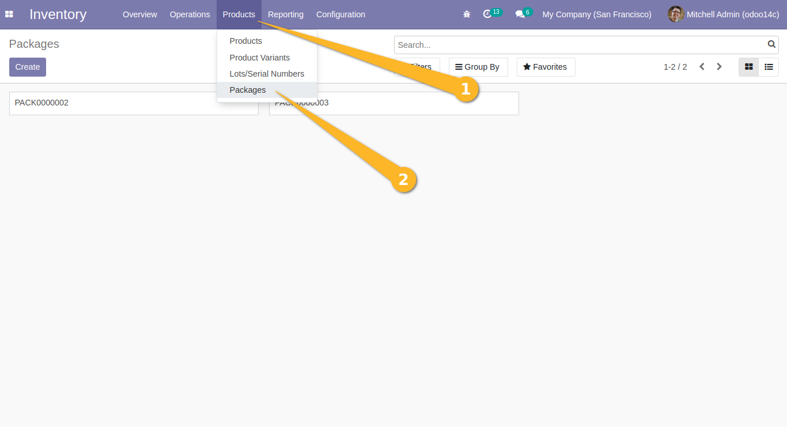
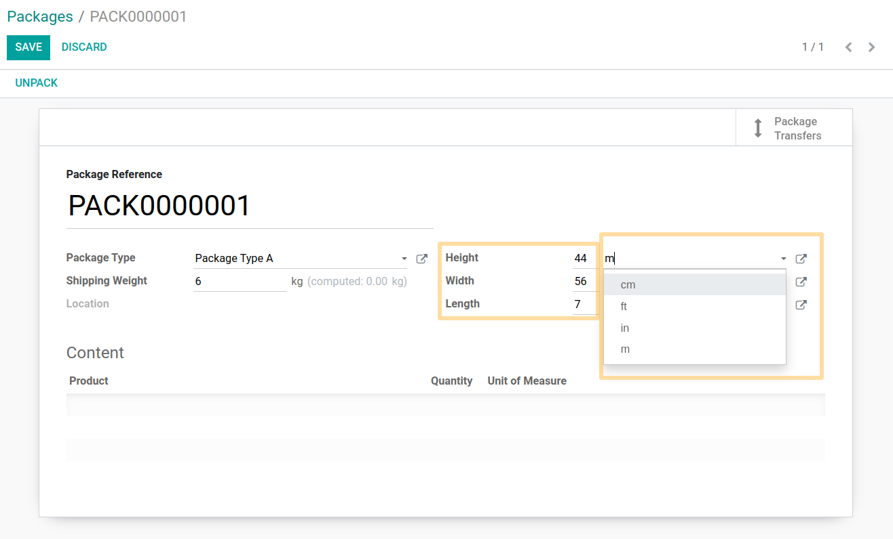

Product Quant Package Dimension
===============================
Add height, width and length to a stock quant package with its UOM for each field.

Usage
-----
As an User of Inventory, I go to ``Inventory > Products > Packages``.

In the form view, I can see three new fields: ``Height``, ``Width`` and ``Length`` that can be in decimal value.
I also can change the unit of measure of each property to ``m`` or ``ft``.

Contributors
------------
* Numigi (tm) and all its contributors (https://bit.ly/numigiens)

More information
----------------
* Meet us at https://bit.ly/numigi-com
