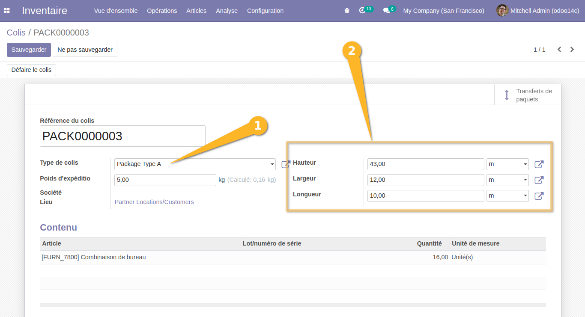
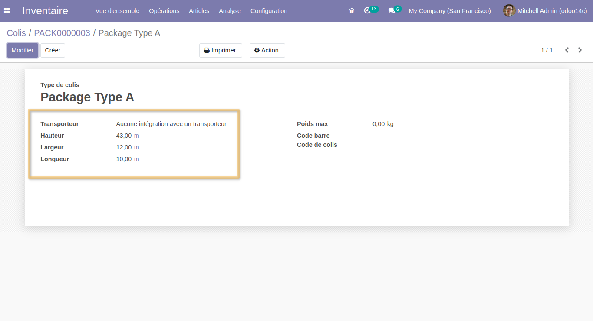

Stock Quant Package Measures from Product Packaging
===================================================
Change dimensions and UOM from packaging type.

Usage
-----
As an User of Inventory, I go to ``Inventory > Products > Packages``.

In the form view, the following fields value will be changed when selecting a package type: 
``Height``, ``Width`` and ``Length``.
Values are set from the value of the package type. 
Then,  I also can change the unit of measure of each property to ``m``, ``ft``, ``inch`` or ``cm``.

If we check the dimensions of the package type, it matches on the changes.

Contributors
------------
* Numigi (tm) and all its contributors (https://bit.ly/numigiens)

More information
----------------
* Meet us at https://bit.ly/numigi-com
