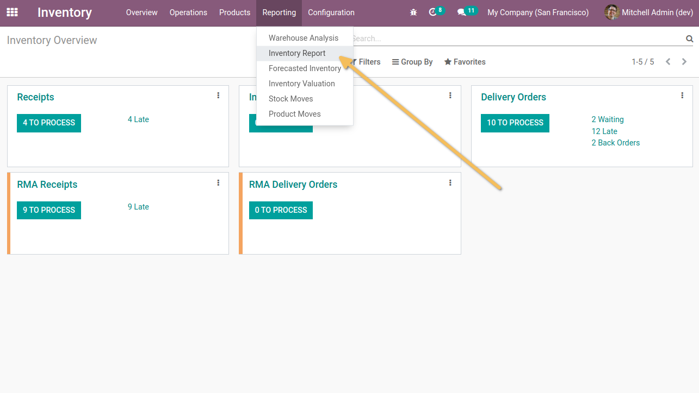
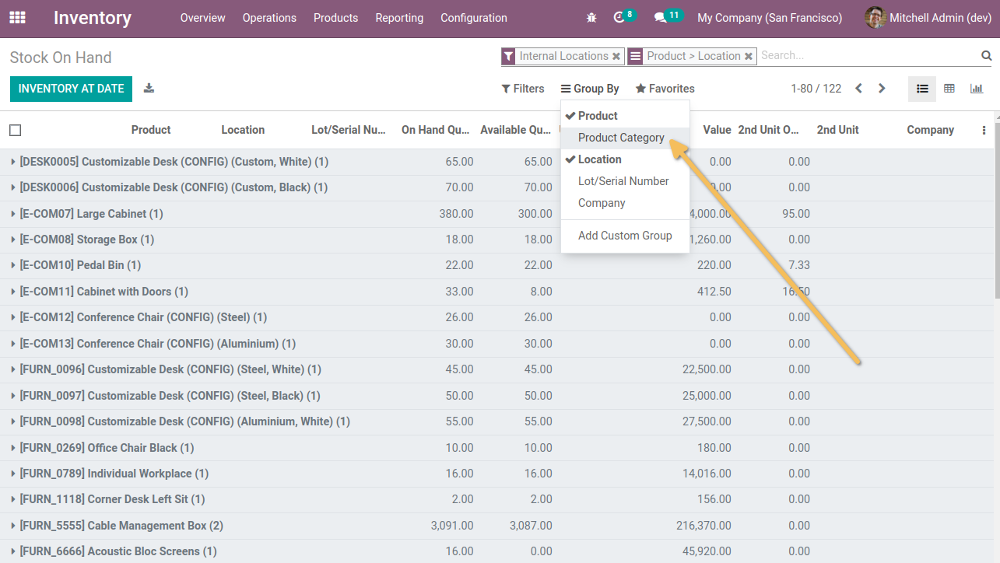
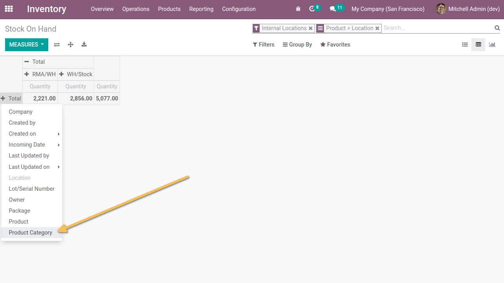
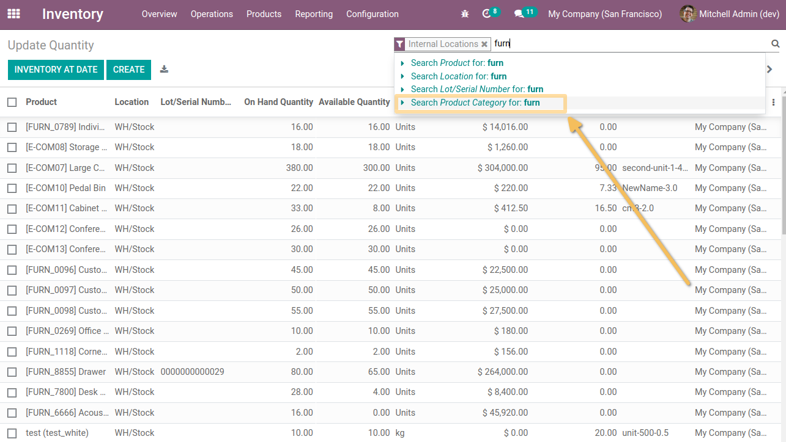

Stock Quant by Category
=======================
This module adds product category field on `Inventory Report` (Inventory / Reporting).

Usage
=====
As an administrator of the `Inventory` application, I go to `Inventory > Reporting > Inventory Report`.

I click on the `Group by` button and I see that a new grouping pre-defined `Product Category` is available.

From the pivot view, I see that I can group (on the 2 axes) by `Product Category`.

I also see that the `Product Category` search criteria is available.

Contributors
------------
* Numigi (tm) and all its contributors (https://bit.ly/numigiens)
