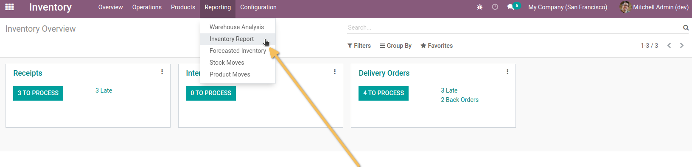
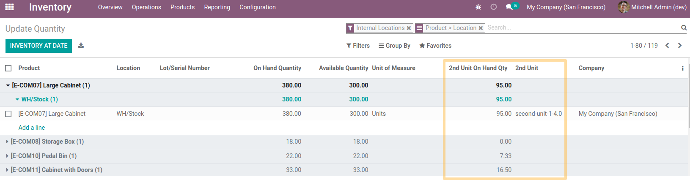
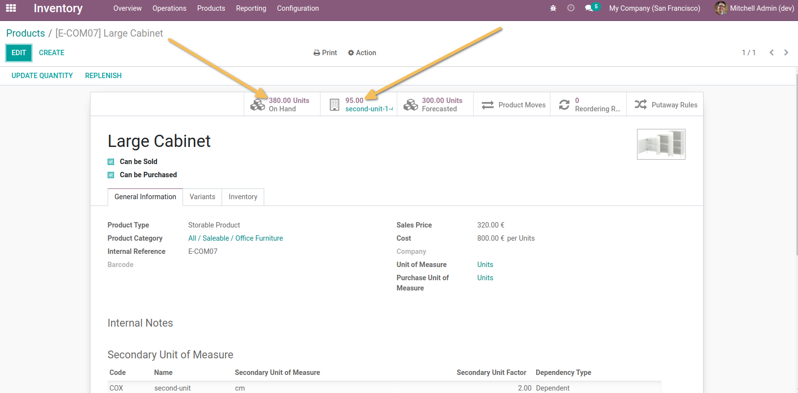
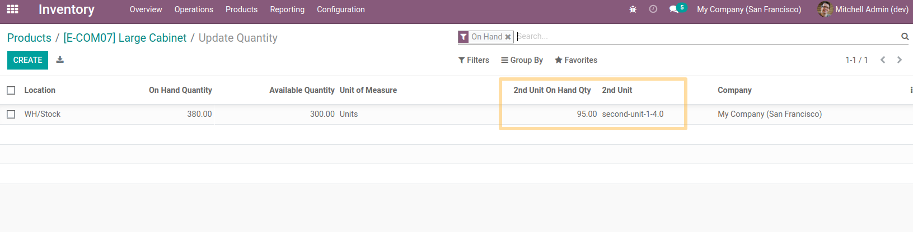
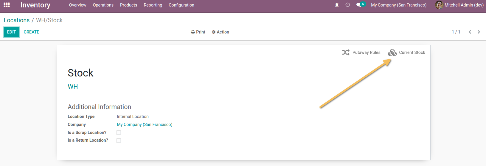
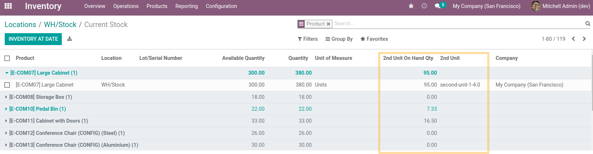

Stock Quant Secondary Unit
==========================
This module allows, for an user in the group `Inventory > Manager`, to see the quantities in stock in the 2nd unit of measure:
* On the stock.quant list view accessible from the inventory report

* On the list view of stock.quant accessible from the 2 smart buttons "In stock" of a product

* On the stock.quant list view accessible from a location's available stock smart button.

Contributors
------------
* Numigi (tm) and all its contributors (https://bit.ly/numigiens)
