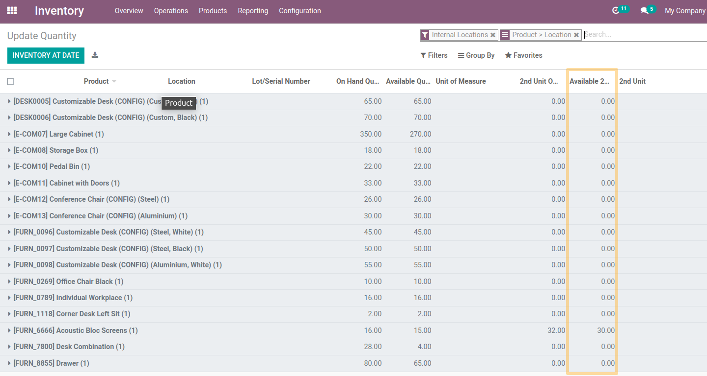

Stock Quant Secondary Unit
==========================
This module allows, for an user in the group `Inventory > Manager`, to see the quantities in stock in the 2nd unit of measure:
* On the stock.quant list view accessible from the inventory report

.. image:: static/description/menu_to_inventory_report.png

* On the list view of stock.quant accessible from the 2 smart buttons "In stock" of a product

* On the stock.quant list view accessible from a location's available stock smart button.

Since the version 1.0.3 :

As an Inventory user, I go to the form view of an item/variant and click on either of the stock smart buttons.

* I notice that a new column `Available 2nd Unit` is present, between the `2nd Unit On Hand Qty` field and the `2nd unit` field.

* I also see that the "Value" field is now after the "2nd unit" field.

.. image:: static/description/value_moved_on_stock_quant.png

* When I click on the 3 small dots, I see that I can choose whether or not to display all the fields available in the view.

As a member of the `Inventory / Administrator` group, I go to `Inventory > Reporting > Inventory Report`.

* I notice that a new column `Available 2nd Unit`  is present, between the `2nd Unit On Hand Qty` field and the `2nd unit`  field.
I also see that the `Value` field is now after the `2nd unit` field.

* When I click on the 3 small dots, I see that I can choose whether or not to display all the fields available in the view.

Contributors
------------
* Numigi (tm) and all its contributors (https://bit.ly/numigiens)
