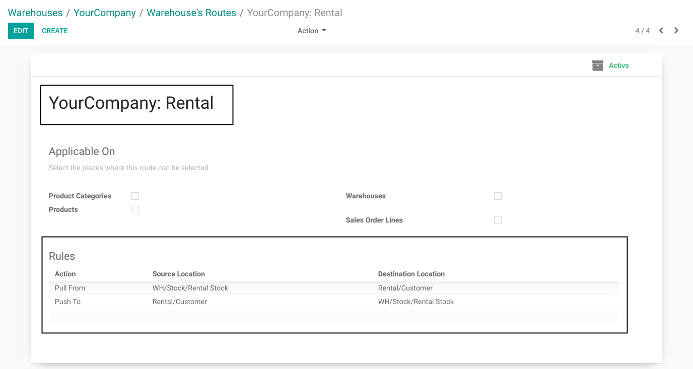
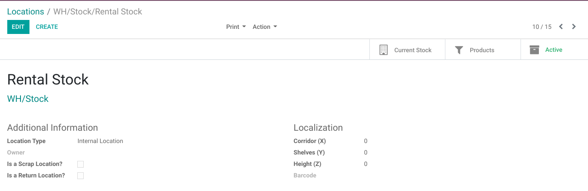
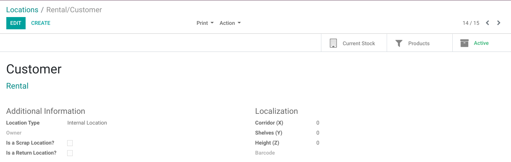
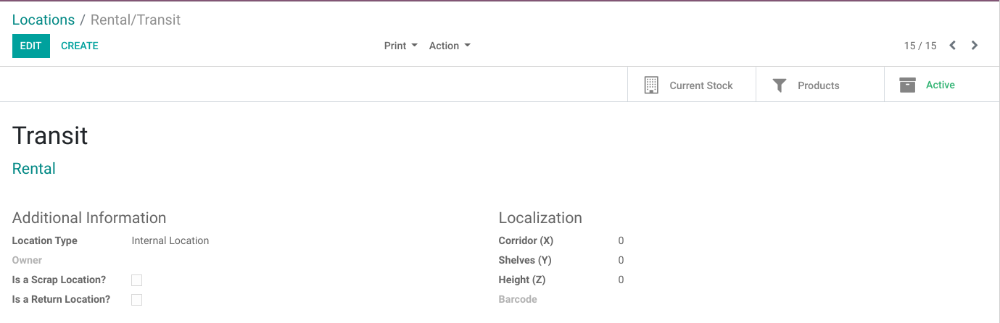

Sale Rental
===========
This module allows to rent products using the ``Sales`` application.

.. contents:: Table of Contents

Rental Route
------------
A rental sale order uses a special route.

This route is automatically created for each warehouse.

The route contains a pull from `Rental Stock`_ to `Rental Customer`_
and a push from `Rental Customer`_ back to `Rental Stock`_.

Rental Stock
~~~~~~~~~~~~
This is an internal location defined below the root location of the warehouse.

It is used for stocks available for rental.

This location is separated from the warehouse inventory location for stocks available for sale.

Rental Customer
~~~~~~~~~~~~~~~
This is a unique location used for every rental.

This location is not bound to a warehouse.

It is of type ``Internal`` (not ``Customer``).
This prevents the rented products from being deduced from the accounting inventory.

Rental Transit
~~~~~~~~~~~~~~
This location is used for products in transit between `Rental Stock`_ and `Rental Customer`_.

For example, it can represent a truck, transporting the products to the customer
or back to the warehouse.

This location is created by default and is not bound to a specific warehouse.

By default, it is not used on the rental route.
You may add a stock rule to the route if you need it (see `Editing The Rental Route`_).

Editing The Rental Route
~~~~~~~~~~~~~~~~~~~~~~~~
You may edit the rental route of a warehouse and the stock rules defined on it.

Your changes will not be overriden when updating the module.

For example, you could add a second delivery or receipt step to the route.

Contributors
------------
* Numigi (tm) and all its contributors (https://bit.ly/numigiens)

More information
----------------
* Meet us at https://bit.ly/numigi-com
