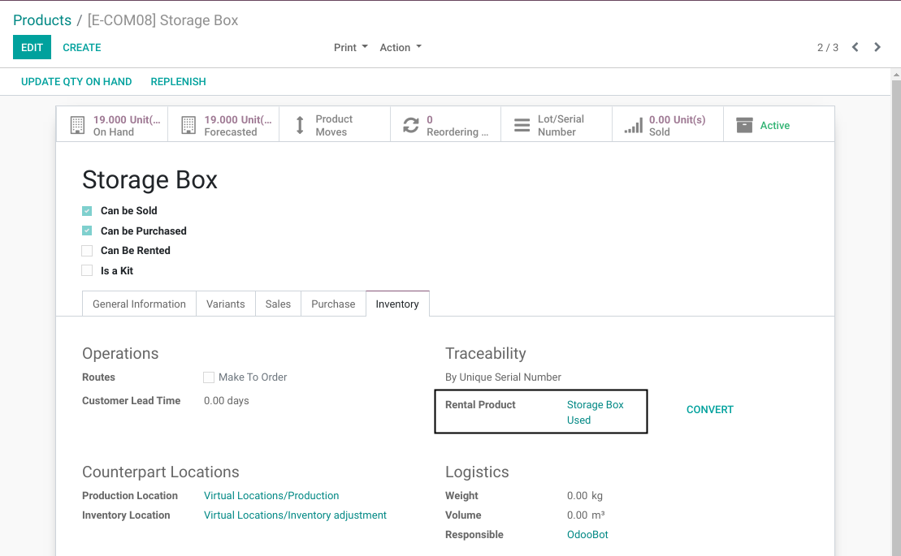
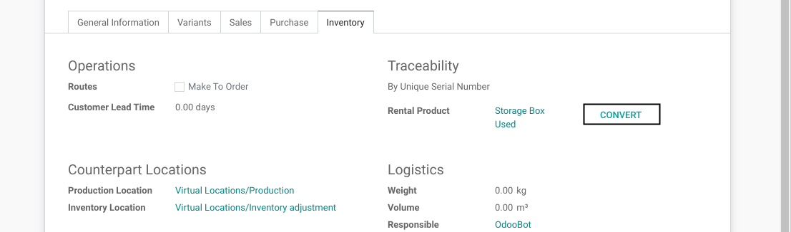
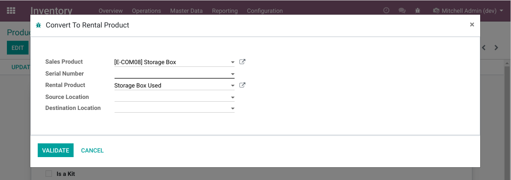
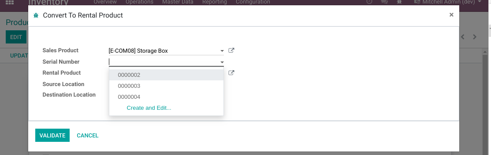
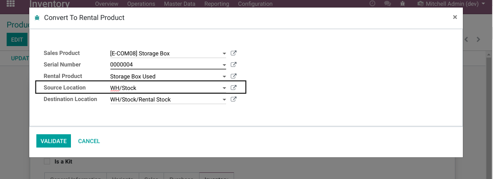
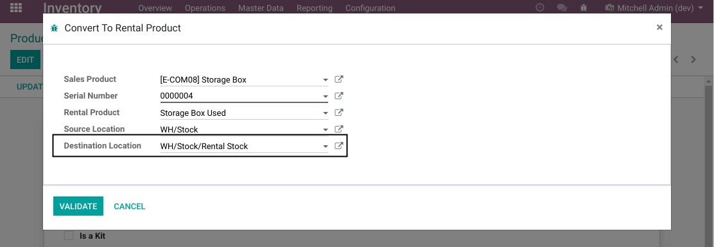
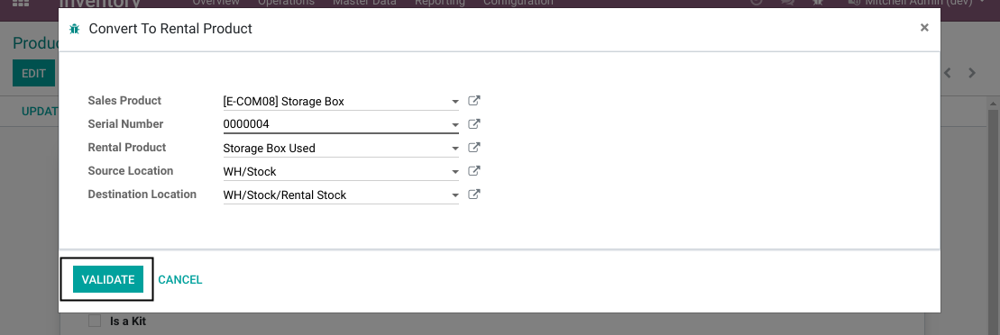
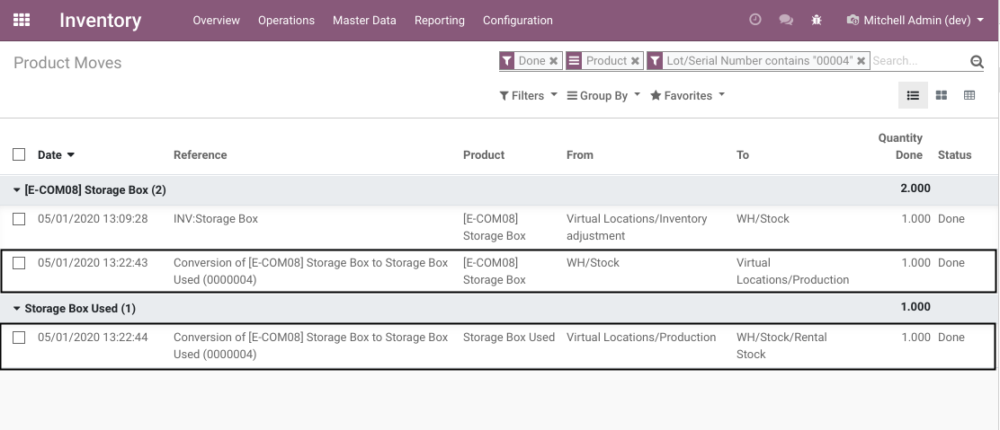
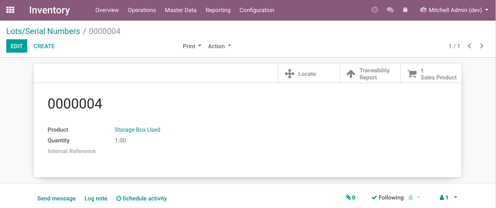
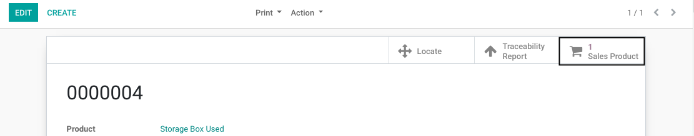

Stock Rental Conversion
=======================
This module allows to convert a stockable product into a rental product.

.. contents:: Table of Contents

Context
-------
When managing equipment rental, it is common to have a distinct stock for new products inteded to sales versus used products intended to rental.

In this scenario, different products are used to represent new and old products.

Configuration
-------------
I go to the form view of my salable product.

In the ``Inventory Tab``, I find a new field ``Related Rental Product``.

This field allows to select a default product to use when converting this salable product
to a rentalable product.

Usage
-----
Next to the ``Related Rental Product`` field, I find a button ``Convert``.

When I click on this button, a wizard is opened.

Serial Numbers
~~~~~~~~~~~~~~
The wizard has a field to select a serial number.

This field is visible and mandatory if the product is tracked by serial number.

It allows to select only products currently in stock.

Origin Location
~~~~~~~~~~~~~~~
After selecting the serial number, the origin location is automatically filled
with the location where this serial number is.

For a product tracked with a serial number, the origin location is readonly.

Destination Location
~~~~~~~~~~~~~~~~~~~~
By default, the destination location is the stock location related to the warehouse
of the origin location.

Validation
~~~~~~~~~~
After filling the wizard form, I click on ``Validate``.

Stock Moves
~~~~~~~~~~~
After validating the wizard, 2 stock moves are created.

The salable product is moved from the source location to the production location.

The rentalable product is moved from the production location to the destination location.

New Serial Number
~~~~~~~~~~~~~~~~~
A new serial number is created for the new rental product.
This serial number has the same number.

A smart button allows to display the original serial number.

Contributors
------------
* Numigi (tm) and all its contributors (https://bit.ly/numigiens)

More information
----------------
* Meet us at https://bit.ly/numigi-com
