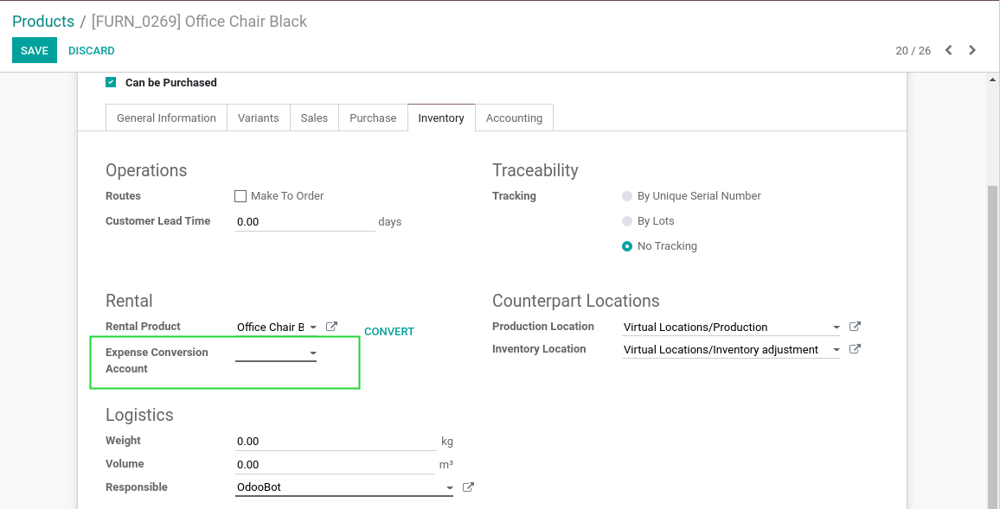
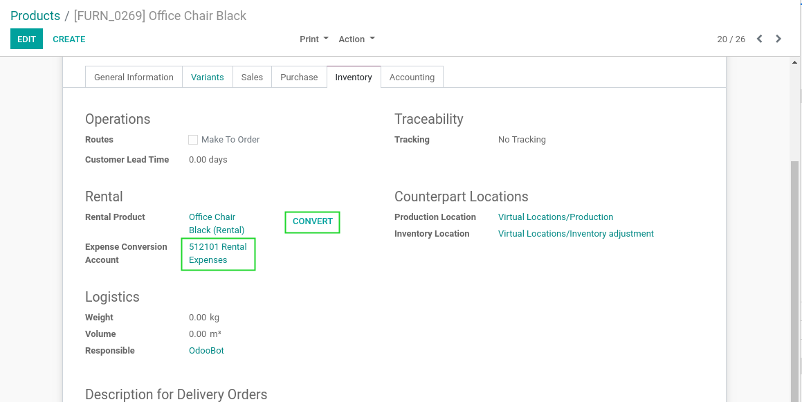
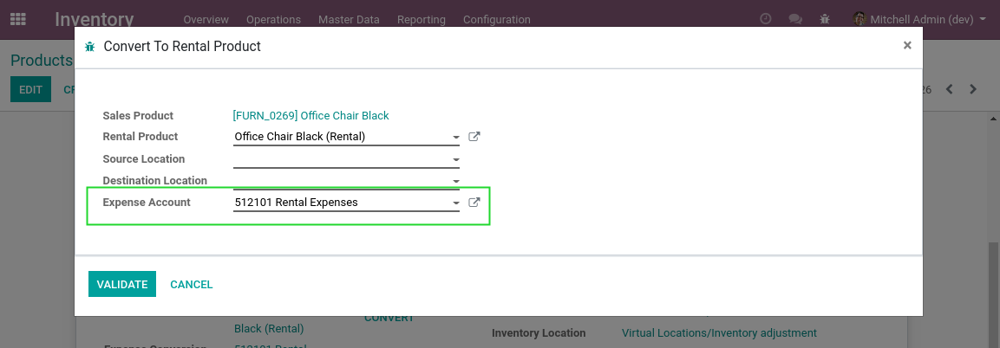
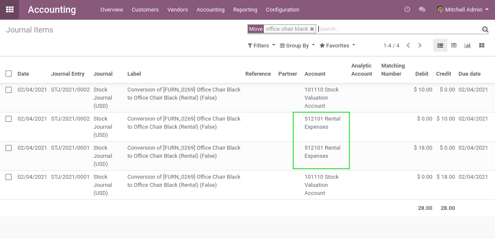

Stock Rental Conversion Account
===============================
This module allows to use a specific expense account when convert a salable product into a rental product.

.. contents:: Table of Contents

Context
-------
The module stock_rental_conversion allows to convert a salable product into a rental product.

Without this module, the stock output account is used as counterpart for the journal entries generated by the stock moves.

Usage
-----
I go to the form view of my salable product.

I notice a new field ``Conversion Expense Account``.

I select an account.

I click on Convert.

I notice that the conversion account is filled inside the wizard.

After validating, I go to the list of journal entries related to the conversion.

I notice that the selected account was used as counterpart.

Contributors
------------
* Numigi (tm) and all its contributors (https://bit.ly/numigiens)

More information
----------------
* Meet us at https://bit.ly/numigi-com
