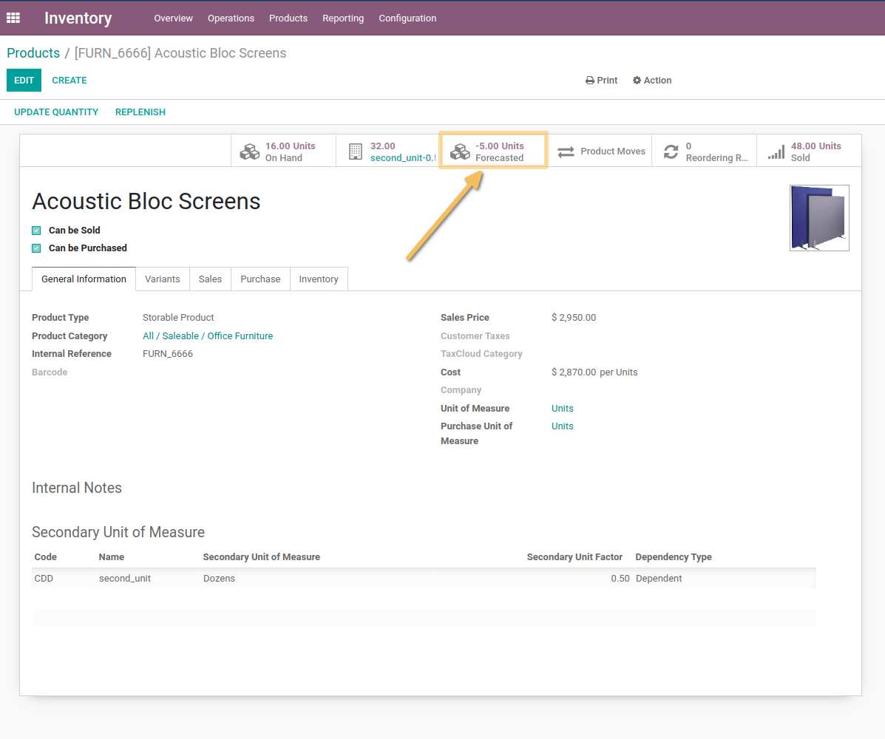
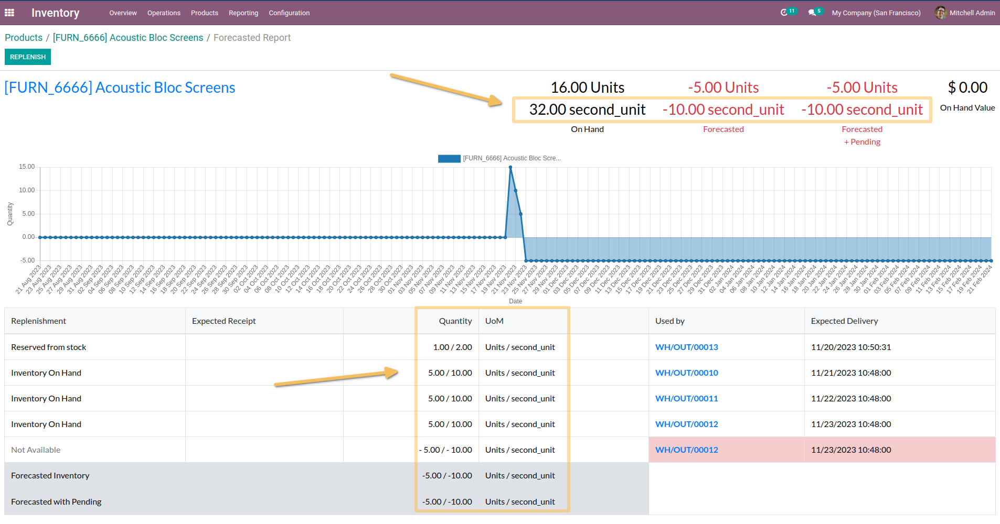
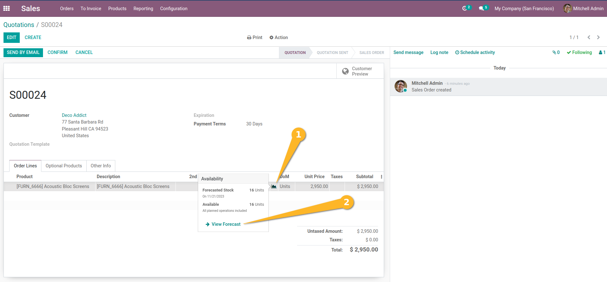
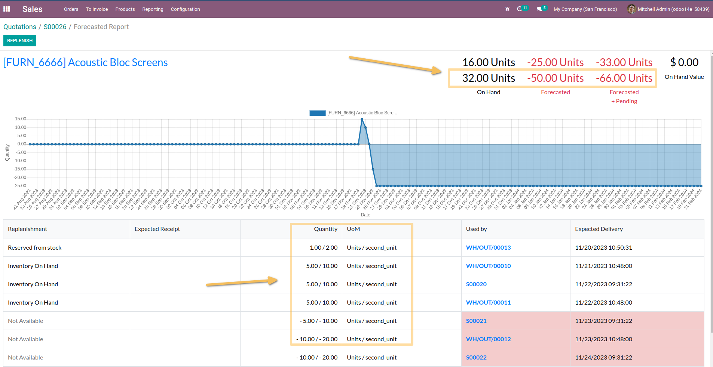

Stock Replenish Report Secondary Unit
=====================================
This module allows to have, in the inventory forecast report, the forecast quantities in the 2nd unit of measurement.

Usage
-----
As an inventory user, I go to the form view of an product/variant and click on the `Forecasted` smart button.

I see that all quantities in the forecast report are displayed in the secondary unit for inventory.

As a Sales user, I go to the form view of a sale and from the order lines, I click on the Forecast widget, then on View forecast.

I see that the report displays all the quantities in both units of measurement.

Contributors
------------
* Numigi (tm) and all its contributors (https://bit.ly/numigiens)
