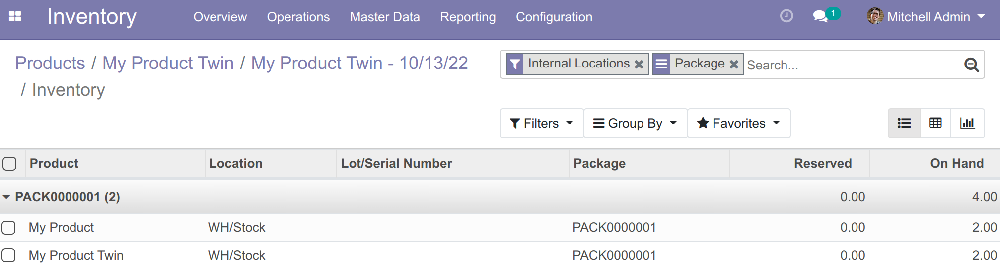
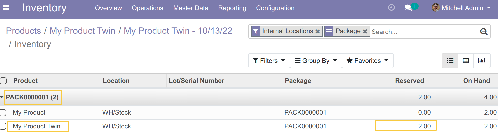
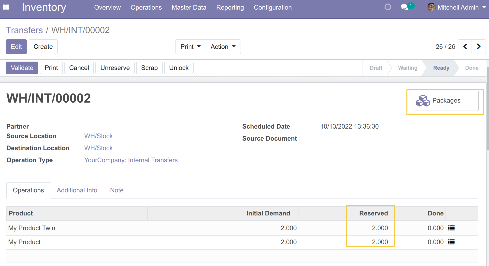
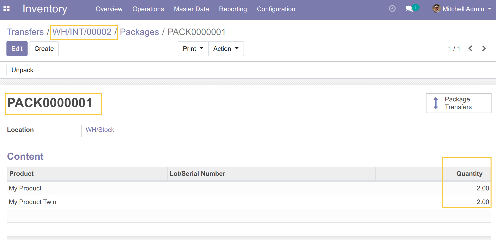

Stock Reserve Quant Package
===========================

The module allows to prevent the partial reservation of a package.

.. contents:: Table of Contents

Context
-------

In the native version of Odoo, you can reserve any product regardless of whether it belongs to a package or not.
Depending on our needs, we cannot make a partial reservation of a package.
So we check if we can reserve the whole package, if so we make the reservation otherwise we undo it.

Native behavior
~~~~~~~~~~~~~~~

I have a package that contains 2 quantities of each of the two products (`My Product` and `My Product Twin`)

I go to `Inventory / Operations / Transfers` then I create an internal stock transfer operation
for product `My Product Twin` only and I check availability, the system finds the quantity requested for the operation and reserves the product.

.. image:: static/description/reserved_quantity_1.png

This makes a partial reservation of the package.

Custom behavior of this module
~~~~~~~~~~~~~~~~~~~~~~~~~~~~~~

After installing this module, I go to `Inventory / Operations / Transfers`
then I create an internal stock transfer operation
for product `My Product Twin` only and I check availability.
The system can't do the reservation because the product belongs to a package
that contains other products that are not part of the transfer operation.

.. image:: static/description/product_unreserved.png

Now, if I add the other product of the package to my transfer operation,
the system reserve the entire package.

I can see clearly that the package is associated to my transfer operation.

Contributors
------------
* Numigi (tm) and all its contributors (https://bit.ly/numigiens)

More information
----------------
* Meet us at https://bit.ly/numigi-com
