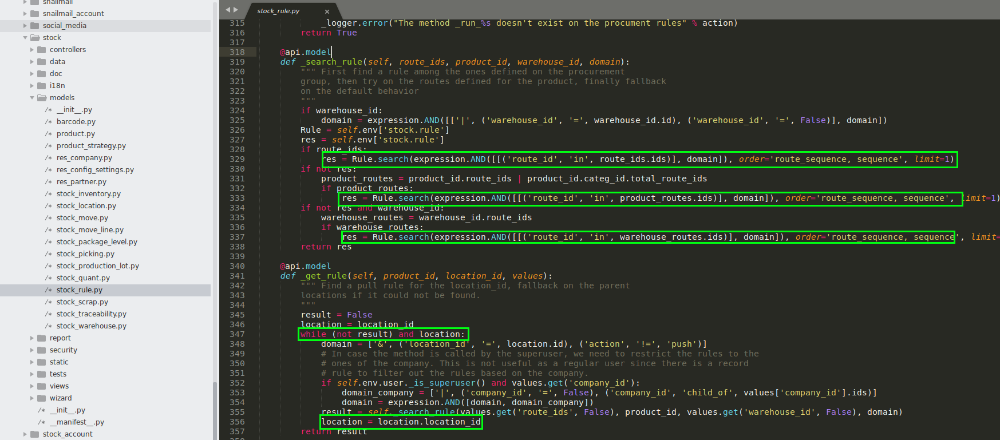

Stock Route Optimized
=====================
This module improves performance and flexibility of stock routes.

.. contents:: Table of Contents

Context
-------
In vanilla Odoo, when a sale order is confirmed, stock rules are evaluated in order
to generate stock moves for each sold items.

The problem comes with the selection of a stock rule for a given product.

For each sold product:
    For each step of the delivery route:
        For each location (going through the parent hierarchy of routes):
            For each search operation (up to 3):
                Multiple SELECT queries are executed to the database (because the domain is complex)

Suppose a 3 steps delivery route, with an order of 50 products.
The performance cost is non-negligeable, because of the high number of SELECT queries to the database.

Another issue with this mecanism is that it can not be extended without adding clauses
to the domain (therefore slowing down the system even more).

Hypothesis
----------
In a normal Odoo application, there are not thousands of stock routes and rules to evaluate.

With this condition, querying to the database every time to find matching routes
is not a good idea.

Stock rules can be all loaded and filtered directly in python in an efficient way.

Overview
--------
The module overrides the method ``_get_rule``.

Instead of using search domains to select stock rules, the module loads all rules related to the
given company and filter the rules directly in python.

Special Routes
--------------
The module adds the concept of a special route.

.. image:: static/description/special_route.png

A special route is a route used to filter per product the rules to apply for another route.

For example, you may define a purchase route with two steps.

.. image:: static/description/receipt_route_two_steps.png

The special route is set on the first two rules.
These rules will be applied only for products linked to the special route.

The third rule will be applied as default rule for other products.

Therefore, some products will be received in two steps and others will be received in one step.

Rule Order
~~~~~~~~~~
Because stock rules are evaluated in order of sequence, it is important that rules
with a special route appear first in sequence.

Contributors
------------
* Numigi (tm) and all its contributors (https://bit.ly/numigiens)
