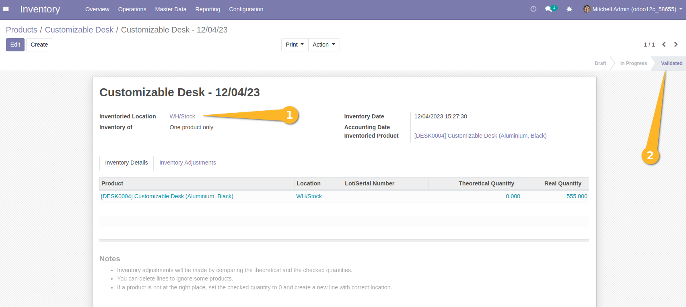
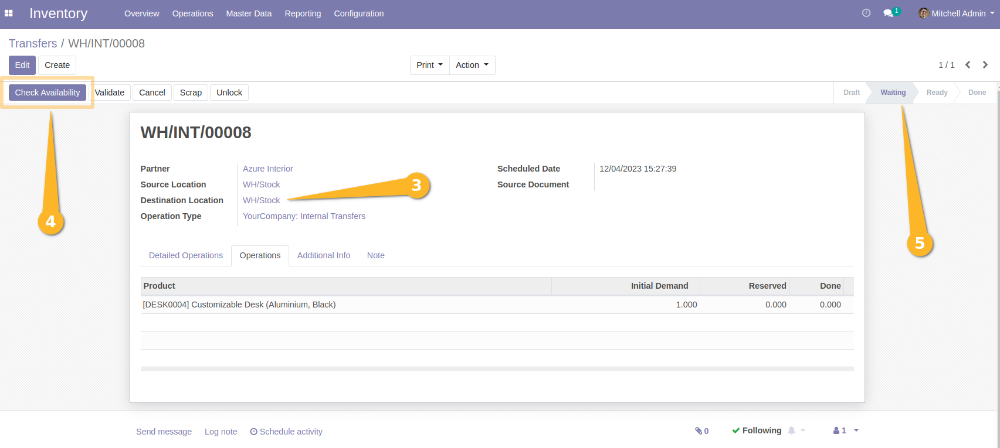
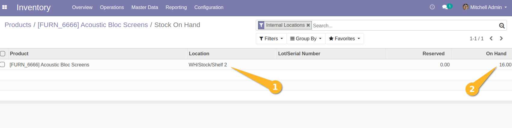
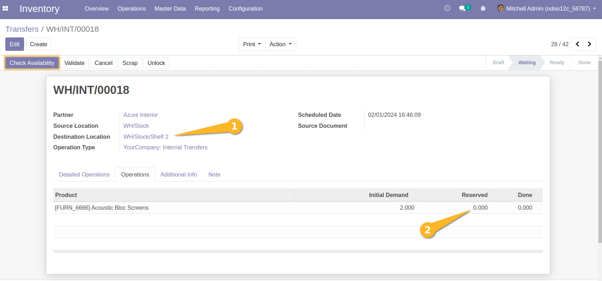
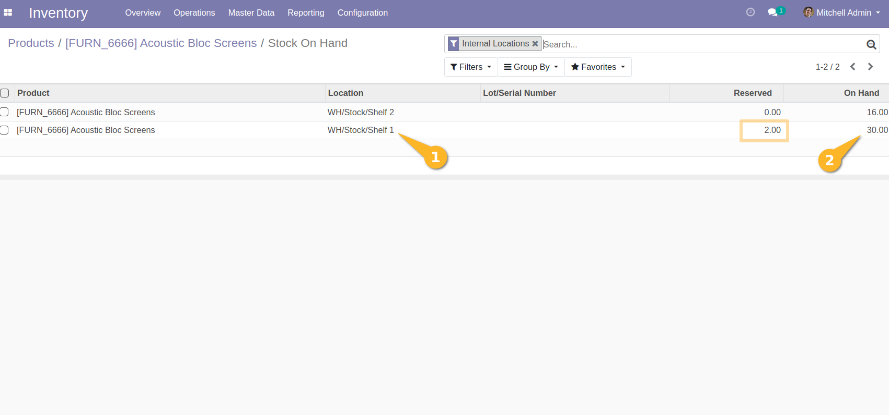
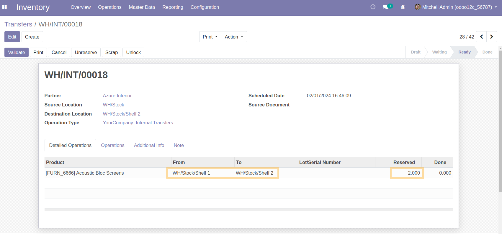

Stock Same Location Disable Reservation
=======================================
This module allows to prevent the system from reserving inventory in an origin location, on picking or on quant, similar to the destination location.

Usage
-----
*Case A*
On a product, I do :

And on a picking, I do :

Even if there are only quantities in the WH/Stock location, the system does not reserve these quantities because the location is the same as the destination location.
So the picking will still stay on the same state.

*Case B*

Now, on a product, I do :

And on a picking, I do :

This still will be blocked by system. No reserved product was made, because the system did not found any avalaible quantity
on different location.

In other case, I will have a reserved quantity on quant and picking:

Contributors
------------
* Numigi (tm) and all its contributors (https://bit.ly/numigiens)
