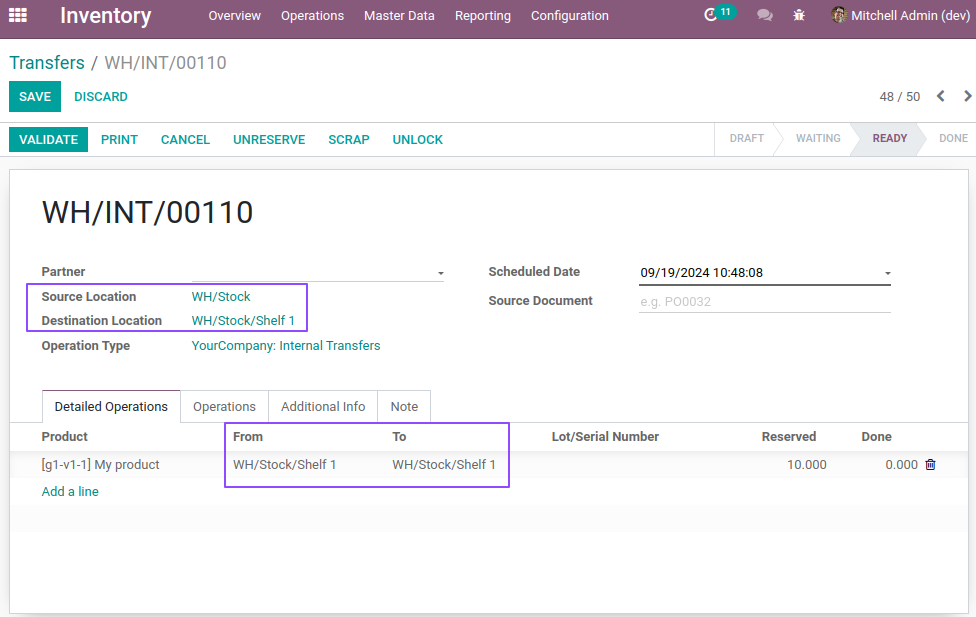
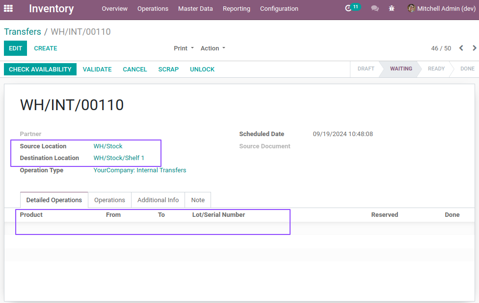
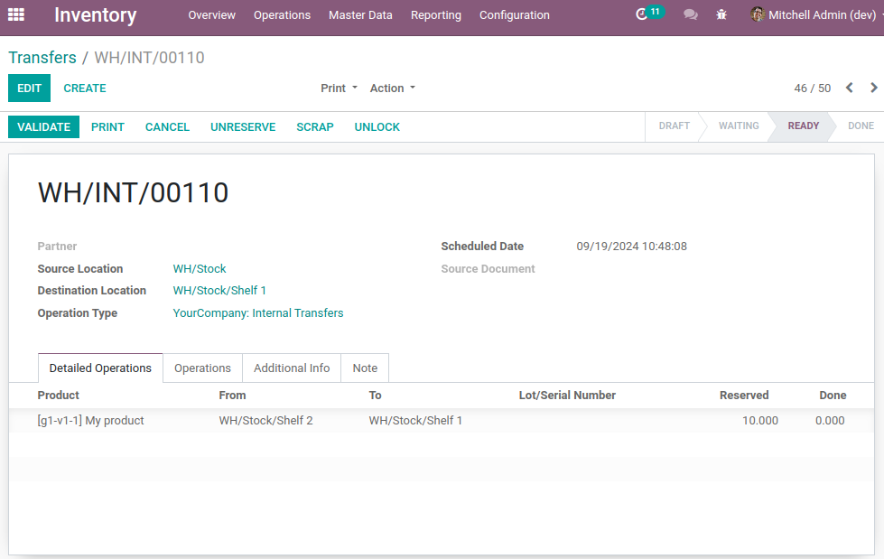

Stock Same Location Disable Reservation
=======================================
This module prevents the system from reserving stock at the destination
location of a stock transfer.

Context:
--------

In the standard version of Odoo, if there is stock in the location `Shelf 1`,
which is a child of the `Stock` location, and I create an internal transfer
from the source location `Stock` to the destination `Shelf 1`, the system will,
if it doesn’t find the requested quantity in the `Stock` location, search in
the child locations. It will then reserve stock from `Shelf 1`, which is the
same as the destination location.

With this module, we aim to prevent the system from reserving stock from
the destination location.

Before Installing the module
----------------------------
In my picking, when I click on `Check Availability`,the system can reserve
stock from the destination location of the move:

After Installing the module
---------------------------
In my picking, when I click on `Check Availability`, the system no longer
reserves stock from the destination location, it will only search in the source
location and its childs location, excluding the destination location.

If I go to my product and add quantities in `Shelf 2`, witch is a child location
of `Stock`, the system can reserve stock from `Shelf 2` as it is different from
the destination location.

Contributors
------------
* Numigi (tm) and all its contributors (https://bit.ly/numigiens)
