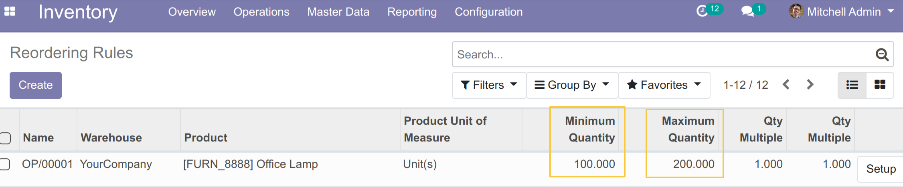
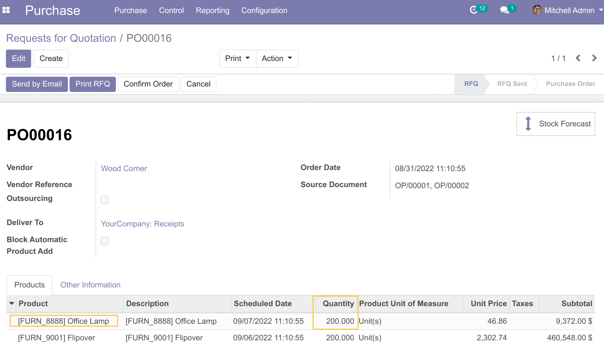
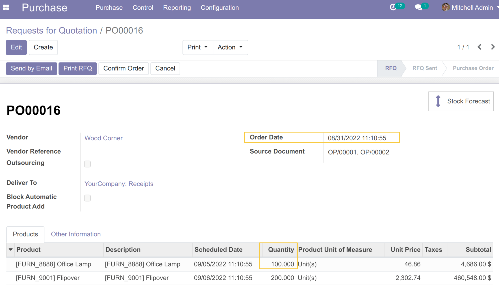
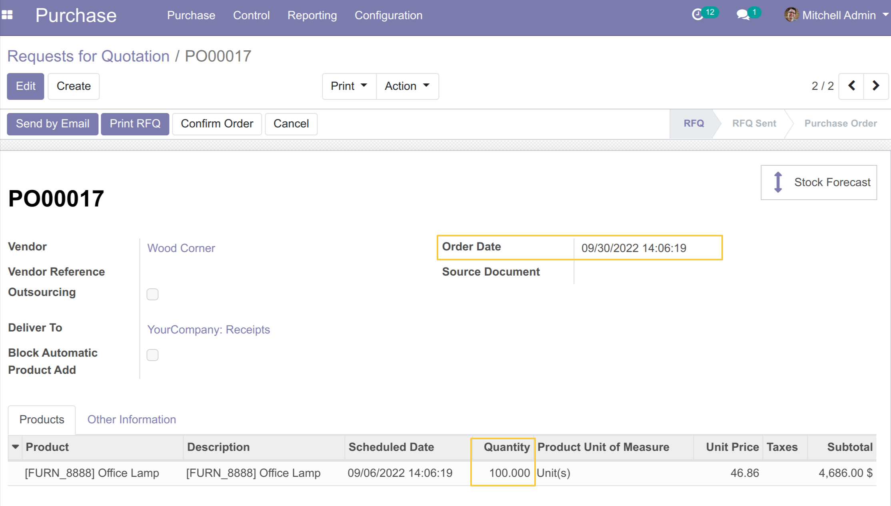
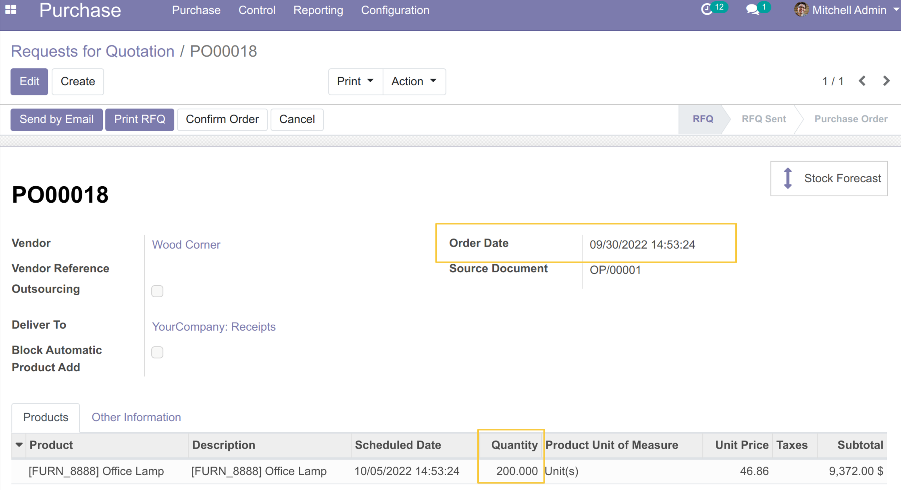

Project List Specific
=====================
The module changes the native behavior of calculating quantities
that are not yet in virtual stock but must be deducted from orderpoints.
It takes into account the quantity of all RFQ lines created in the system
instead of those created by the reordering rules.

Overview
--------
Suppose we have a product with a following reordering rule:

I go to ``Inventory / Operations / Run Scheduler`` then I click on the ``Run Scheduler`` button.

A request for quotation will be created for this product:

I decide to split the quotation on 2 quotations to order 100 units for this month and the 100 units for the next month.

I go to run the scheduler again.

Before
~~~~~~

The scheduler doesn't take in account the quantity in my second RFQ created manually, so it adds 100 units automatically to the RFQ.

After
~~~~~

The scheduler takes in account the quantity requested in any RFQ created for the same product.
So it doesn't update the RFQ because the sum of the quantities ordered reaches the maximum.

Contributors
------------
* Numigi (tm) and all its contributors (https://bit.ly/numigiens)

More information
----------------
* Meet us at https://bit.ly/numigi-com
