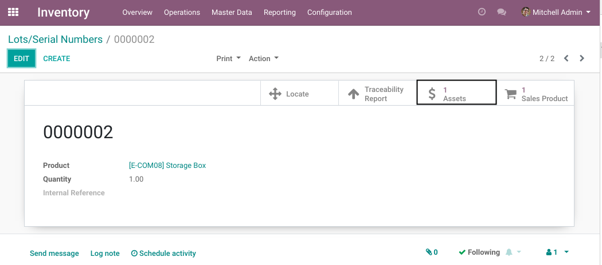
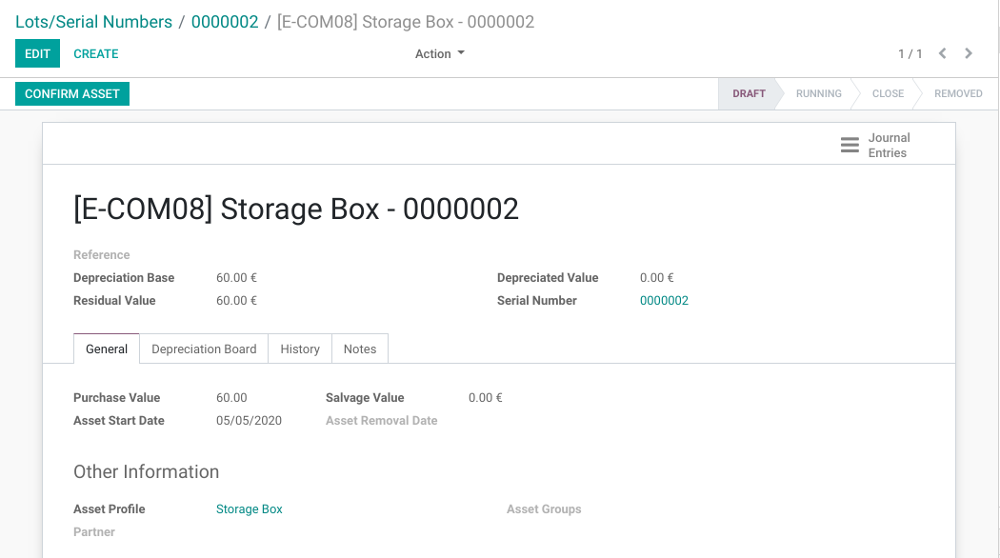

Stock Serial Asset
==================
This module allows to create an asset from a serial number.

On the form view of a serial number, I find a new smart button ``Assets``.
This button is only visible when the serial number is linked to an asset.

When clicking on the button, the form view of the related asset is shown.

Known Issues
------------
This module does not define how an asset is created from a serial number.

Contributors
------------
* Numigi (tm) and all its contributors (https://bit.ly/numigiens)
