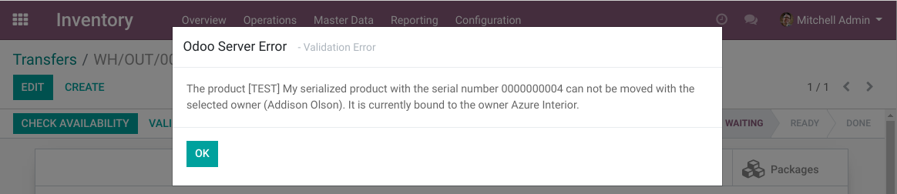

Stock Serial Single Quant
=========================
This module prevents having multiple quants with the same serial number.

.. contents:: Table of Contents

Context
-------
In Odoo, you can track a product by unique serial number or by production lot.

When tracking by unique serial number, Odoo does not completely prevent moving
a product with a serial number from a location that does not contain this specific number.

This means that you can end up with 3 quants in your system with the same number.

* Two positive quants of one unit
* One negative quant of one unit

Since there are two positive quants with the same number, the location
of the product can not be automatically established for sure.

In some cases, Odoo does prevent inconsistency in quants of serial numbers.
However, the error message is not very explicit:

..

    A serial number should only be linked to a single product.

Constraints
-----------
The module adds several constraints to stock move lines with unique serial numbers.

Each of these constraints raises a detailed error message.
This message contains the name of the product and the serial number in cause,
as well as the cause of the failure.

Locations
~~~~~~~~~
If the serial number has a quant,
the source location of the move must be that quant's location (or any children location).

Packages
~~~~~~~~
If the serial number has a quant, the source package of the move must match the quant's source package.

Owners (Consignment)
~~~~~~~~~~~~~~~~~~~~
If the serial number has a quant, the owner of the stock move line must match the quant's owner.

Contributors
------------
* Numigi (tm) and all its contributors (https://bit.ly/numigiens)
